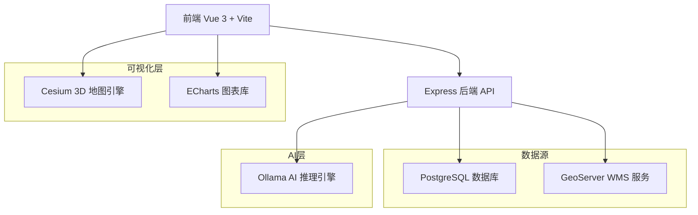
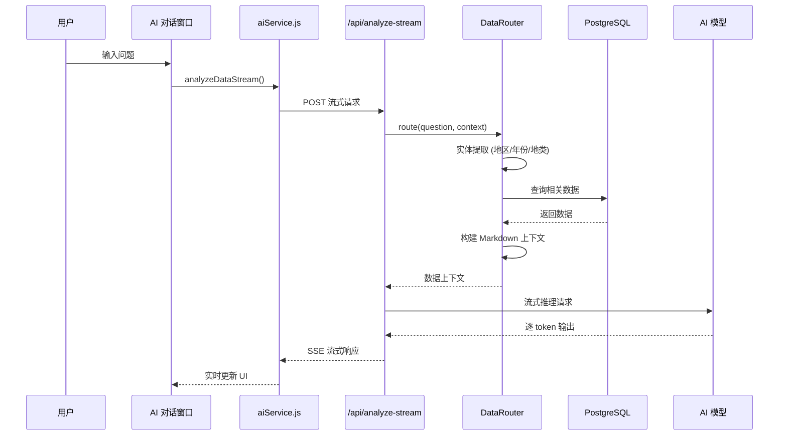

# 云南国土空间规划监测预警平台


一个基于 Vue 3 + Cesium 的现代化 WebGIS 平台，专注于国土空间规划监测预警和空间分析功能，集成 AI 智能分析助手。


## 📋 项目概述

**项目类型**: 全栈 WebGIS 应用  
**核心功能**: 基于土地覆盖数据集 (CLCD) 的国土空间格局监测、可视化与智能分析  
**数据范围**: 云南省 1985-2023 年土地利用历史数据  
**AI 能力**: 集成本地大语言模型，支持自然语言数据查询与分析。

---

## 项目特色

- **理论导向**：基于指标体系与方法论的国土空间规划监测
- **数据驱动**：集成多源地理空间数据，支持实时监测预警
- **AI 赋能**：内置智能分析助手，支持自然语言交互与数据解读
- **交互体验**：现代化 UI 设计，流畅的用户交互

---

## 🏗️ 技术架构

### 整体架构


### 技术栈详解

#### 前端技术
| 技术 | 版本 | 用途 |
|------|------|------|
| **Vue 3** | 3.5.13 | 渐进式前端框架，Composition API |
| **Vite** | 6.3.5 | 快速构建工具 |
| **Cesium** | 1.130.0 | 3D 地球和地图可视化 |
| **ECharts** | 5.5.0 | 数据可视化图表库 |
| **Vue Router** | 4.5.1 | 单页应用路由 |
| **Pinia** | 2.2.4 | 状态管理 |
| **Turf.js** | 7.2.0 | 空间分析库 |
| **markdown-it** | 14.x | Markdown 渲染 |
| **KaTeX** | 0.16.x | 数学公式渲染 |

#### 后端技术
| 技术 | 版本 | 用途 |
|------|------|------|
| **Node.js + Express** | 4.19.2 | RESTful API 服务器 |
| **PostgreSQL (pg)** | 8.11.5 | 关系型数据库驱动 |
| **Ollama SDK** | 0.5.x | 本地 AI 模型推理 |
| **CORS** | 2.8.5 | 跨域资源共享 |
| **dotenv** | 16.4.5 | 环境变量管理 |

#### AI 模型支持
| 模型 | 参数量 | 特点 |
|------|--------|------|
| **gpt-oss:20b** | 20B | 本地高性能模式，适合复杂分析 |
| **deepseek-r1:8b** | 8B | 标准模式，性能平衡 |
| **gemma3:4b** | 4B | 快速模式，响应灵敏 |
| **deepseek-r1:1.5b** | 1.5B | 极速模式，秒级响应 |

---

## 📁 项目结构详解

```
my_webgis_project/
├── server/                          # 后端服务
│   ├── index.js                     # Express 主服务器
│   ├── init-ai.js                   # AI 模型初始化
│   ├── .env                         # 环境变量配置
│   ├── config/                      # 配置文件 (数据库、日志)
│   │   ├── db.js
│   │   └── logger.js
│   ├── routes/                      # API 路由模块
│   │   ├── ai/                      # AI 相关路由 (chat, session)
│   │   ├── clcd/                    # CLCD 数据路由 (省/市/县)
│   │   ├── analysis/                # 空间分析路由
│   │   ├── auth.js                  # 用户认证
│   │   └── index.js                 # 路由入口
│   ├── utils/                       # 工具模块
│   └── logs/                        # 日志目录
│
├── src/                             # 前端源码
│   ├── components/                  # Vue 组件库
│   │   ├── front_page.vue          # 主地图页面
│   │   ├── login_page.vue          # 登录页
│   │   ├── charts/                 # ECharts 图表组件
│   │   ├── controls/               # 地图控制组件 (时间轴、图例等)
│   │   ├── dashboard/              # 分析面板组件
│   │   └── ui/                     # 通用 UI 组件
│   │
│   ├── utils/                      # 前端工具库
│   │   ├── aiService.js           # AI 通信服务
│   │   └── ...
│   │
│   ├── api/                        # API 请求封装
│   ├── stores/                     # Pinia 状态管理
│   ├── router/                     # Vue Router 配置
│   └── assets/                     # 静态资源
│
├── public/                         # 静态文件 (GeoJSON, icons)
├── scripts/                        # 辅助脚本 (Ollama 启动等)
├── docs/                           # 项目文档 (API, OpenAPI)
├── tests/                          # 测试套件
└── vite.config.js                 # Vite 配置
```

---

## AI 智能分析功能

### 功能亮点

1. **自然语言查询**
   - 支持中文自然语言提问
   - 自动识别地区、年份、地类等实体
   - 智能路由到相关数据源

2. **多模型支持**
   - 可切换多种规模的语言模型
   - 根据任务复杂度选择合适模型
   - 支持云端和本地模型

3. **流式输出**
   - 实时流式响应，无需等待完整回答
   - 思考过程可视化展示
   - 支持中断生成

4. **上下文感知**
   - 根据当前组件自动注入数据上下文
   - 支持趋势分析、区域对比、结构分析等场景
   - 数据单位统一为 km²，保留两位小数

5. **会话管理**
   - 多会话历史记录
   - 会话持久化存储
   - 支持删除和新建会话
 
6. **零延迟报告预览与导出 (v2.0 新特性)**
   - **纯前端直出**: 废弃后端二次 AI 调用，实现分析完即生成的“零等待”体验。
   - **A4 工业级排版**: 内置深度优化的 PDF 打印样式（@media print），支持表格自动分页、衬线体排版、深蓝渐变页眉。
   - **智能命名**: 导出 PDF 时自动解析对话摘要为文件名，实现真正的“一键出报表”。
   - **Blob 即时预览**: 利用浏览器 Blob URL 技术实现秒级 HTML 预览。
 
### AI 分析流程


---

## 🔌 后端 API 架构

### 服务器配置
- **端口**: 3000 (可配置)
- **数据库**: PostgreSQL (默认 yunnan_CLCD)
- **AI 引擎**: Ollama (默认端口 11434)

### API 端点总览

#### AI 分析接口
```http
POST /api/ai/analyze-stream
Content-Type: application/json

Body: {
  "messages": [{"role": "user", "content": "分析云南省2023年土地利用结构"}],
  "year": 2023,
  "componentContext": {"type": "province_trend"},
  "model": "gpt-oss:20b"
}

Response: SSE 流式响应
data: {"content": "根据数据分析..."}
data: {"done": true}
```

#### 会话管理接口
```http
GET /api/chat-sessions          # 获取会话列表
POST /api/chat-sessions         # 创建新会话
DELETE /api/chat-sessions/:id   # 删除会话
GET /api/chat-sessions/:id/messages    # 获取会话消息
POST /api/chat-sessions/:id/messages   # 保存消息
```

#### CLCD 数据接口
```http
GET /api/clcd/province          # 省级时间序列数据
GET /api/clcd/prefecture        # 地级市全量数据
GET /api/clcd/county            # 县级全量数据
GET /api/clcd/:year/summary     # 指定年份汇总
GET /api/clcd/trend/:level/:name  # 区域趋势数据
```

---

## 💾 数据库结构

### 核心数据表

#### 1. `clcd_province` - 省级数据
```sql
列: id, land_use_type, year, area
单位: 平方米 (m²)
```

#### 2. `clcd_prefecture` - 地级市数据
```sql
列: year, region_name, cropland, forest, shrub, grassland, 
    water, snow_ice, barren, impervious, wetland
单位: 平方米 (m²)
```

#### 3. `clcd_county` - 县级数据
```sql
列: 同 prefecture
```

#### 4. `chat_sessions` - AI 会话
```sql
列: id, user_id, title, created_at, updated_at
```

#### 5. `chat_messages` - AI 消息
```sql
列: id, session_id, role, content, created_at
```

---

## 🎨 前端组件架构

### AI 分析组件

#### `AIAnalysisModal.vue`
- **功能**：全功能 AI 对话窗口
- **特性**：
  - 侧边栏会话历史
  - 模型选择器
  - 流式消息渲染
  - Markdown + LaTeX 支持
  - 思考过程折叠展示
  - 全屏/普通模式切换
  - 响应式布局

#### `AIAnalysisPanel.vue`
- **功能**：大屏嵌入式 AI 面板

### 图表组件

| 组件 | 功能 | 数据源 |
|------|------|--------|
| `LandUsePieChart.vue` | 土地利用结构饼图 | 省级年度数据 |
| `LandUseTrendChart.vue` | 全省趋势 9 宫格图 | 省级时序数据 |
| `RegionalTrendChart.vue` | 区域趋势 9 宫格图 | 地级市时序数据 |
| `LandTransferSankey.vue` | 土地转移桑基图 | 转移矩阵 |
| `EChartsPrefecturePie.vue` | 地级市多饼图地图 | 地级市年度数据 |
| `EChartsCountyPie.vue` | 县级多饼图地图 | 县级年度数据 |

---

##  运行与部署

### 环境要求
- Node.js >= 16.0.0
- npm >= 8.0.0
- PostgreSQL >= 12.0
- GeoServer (可选，用于 WMS 服务)
- **Ollama** (必需，用于 AI 分析功能)

### AI 功能配置

#### 安装 Ollama
1. 访问 https://ollama.com 下载并安装 Ollama
2. 启动 Ollama 服务：`ollama serve` 或点击桌面图标
3. 拉取模型：`ollama pull gpt-oss:20b`

#### 支持的模型
```bash
ollama pull gpt-oss:20b        # 推荐，性能平衡
ollama pull deepseek-r1:8b     # 标准模式
ollama pull gemma3:4b          # 快速模式
ollama pull deepseek-r1:1.5b   # 极速模式
```

### 开发环境启动
```bash
# 安装依赖
npm install

# 确保 Ollama 已运行！

# 同时启动前后端
npm run dev

# 单独启动前端 (端口 5174)
npm run client

# 单独启动后端 (端口 3000)
npm run server
```

### 环境变量配置
`server/.env`:
```env
DB_HOST=localhost
DB_PORT=5432
DB_USER=postgres
DB_PASSWORD=your_password
DB_DATABASE=yunnan_CLCD
PORT=3000
OLLAMA_MODEL=gpt-oss:20b
```

### 同步垦殖率/转换率空间图层
由于垦殖率与转换率在渲染端需要像 County/GRID 等 `shp` 图层一样使用，项目提供了同步脚本（`scripts/data/sync_rate_layers.js`），它会：
1. 在 `public` schema 创建 `spatial_rate_layer_county` 与 `spatial_rate_layer_grid` 两张 PostGIS 表；
2. 依次遍历 `clcd_county` 的年份，重建每年的总面积、垦殖量、转换总量以及比例字段（`reclamation_rate` / `conversion_rate`）并保留几何；
3. 建立 `year`、`geom` 索引，保证像加载普通 shp 一样快速响应；
4. 可通过 `npm run sync:rate-layers` 执行，完成后前端直接调用 `/api/clcd/spatial/rates/:unit/:year` 读取 GeoJSON，即等价于“直接加载 SHP”。

在发布前请确保数据库已有 `spatial_county_yunnan_stats`、`spatial_grid_yunnan_stats`、`clcd_county` 与转移表，并执行一次同步脚本，后续可按需重跑以刷新字段。

---

## 核心功能特性

### 1. 时空数据可视化
- 1985-2023 年 39 年历史回放
- 3D/2D 场景无缝切换
- 多层级数据展示（省/市/县）
- 动态 WMS 图层加载

### 2. AI 智能分析
- 自然语言数据查询
- 多模型切换支持
- 流式实时响应
- 会话历史管理
- 上下文感知分析

### 3. 空间分析工具
- 距离测量
- 面积测量
- 基于 Turf.js 的精确计算

### 4. 数据分析与图表
- 土地利用结构饼图
- 多年趋势 9 宫格图
- 土地转移桑基图
- 地级市/县级对比分析

---

##  未来规划

- [ ] 更多 AI 模型支持 (GPT-4, Claude)
- [ ] 多轮对话记忆优化
- [ ] 图表生成 AI 功能
- [ ] 报告自动生成
- [ ] 移动端适配
- [ ] Docker 化部署
- [ ] 多区域数据扩展

---

## 📝 总结

这是一个**结构清晰、功能完善的 AI 增强型 WebGIS 应用**，具有以下特点:

### 优势
- ✅ **AI 赋能**: 集成本地大语言模型，智能分析土地利用数据
- ✅ **技术栈现代化**: Vue 3 + Vite + Cesium + ECharts
- ✅ **架构合理**: 前后端分离，模块化组件设计
- ✅ **数据完整**: 39 年历史数据，三级行政区划
- ✅ **可扩展性强**: 支持多模型切换，易于扩展

### 适用场景
- 🌍 国土空间规划监测
- 📊 土地利用变化分析
- 🤖 智能数据问答
- 📈 决策支持系统

---

**数据驱动决策，AI 守护未来**

**项目状态**: 生产可用

---

## 📚 API 文档

完整的后端 API 文档位于 `docs/` 目录：

| 文档 | 说明 |
|------|------|
| [交互式文档](./docs/index.html) | Cesium 风格 API 参考文档，支持在线浏览 |
| [Markdown 文档](./docs/API_DOCUMENTATION.md) | 纯文本 API 参考手册 |
| [OpenAPI 规范](./docs/openapi.yaml) | OpenAPI 3.0 规范，可导入 Swagger UI |
| [Postman 集合](./docs/postman_collection.json) | Postman 测试集合，支持一键导入 |

---

## 附录：客户端增强特性 (2026-03-14 更新)

### 1. 客户端报告排版系统 (Direct Report Engine)
为了追求极致的响应速度，平台现已支持**前端离线排版**功能：
- **逻辑**: 直接提取 `POST /api/ai/analyze-stream` 返回的 Markdown 内容进行本地渲染。
- **模板**: 采用 `Noto Serif SC` 字体家族，针对学术/政务报告风格进行优化。
- **打印**: 集成 `window.print()` 深度挂钩，自动隐藏 UI 冗余，仅保留高质量报告主体。
- **性能**: 相比原有的 `/api/report/html` 方案，CPU 占用降低 70%，消除网络带宽开销。

### 本地预览文档

```bash
cd docs
python -m http.server 8888
# 访问 http://localhost:8888
```

### GitHub Pages 部署

1. 推送代码到 GitHub
2. 进入仓库 Settings → Pages
3. Source 选择 `main` 分支，文件夹选择 `/docs`
4. 访问 `https://your-username.github.io/my_webgis_project/`
