# 云南省土地利用变化监测预警评估平台


论文《基于WebGIS和GeoAI Agent的土地利用变化智能监测评估系统》的配套实现代码。系统基于 Vue 3 + Cesium 构建，接入 CLCD 数据集（30m，1985–2023），实现云南省多层级土地利用变化的智能监测、可视化分析与预警评估。


## 项目概述

- **项目类型**: 全栈 WebGIS 应用与 GeoAI 决策支持平台
- **线上地址**: [www.yunnanlucc.xyz](https://www.yunnanlucc.xyz)
- **核心数据**: 中国年度土地覆盖数据集 (CLCD, 30m 分辨率, 1985–2023 年时序数据)
- **空间尺度**: 云南省（全省、16 个地级市/自治州、129 个县级行政区及栅格格网）
- **AI 架构**: 基于 LlamaIndex ReAct Agent 框架与 Model Context Protocol (MCP) 协议，集成领域知识图谱、政策规程文献库与空间分析算子，支持自然语言时空查询、趋势推演与智能决策

---

## 系统全景导览

平台集成了三维数字地球态势感知、时序数据多维看板、空间统计流转分析与 GeoAI 智能决策助手。

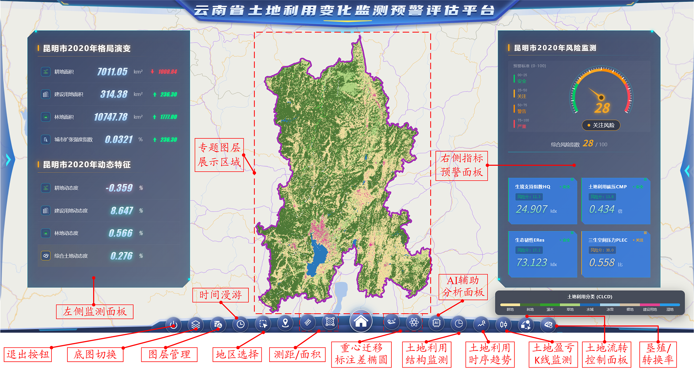

---

## 系统架构

### 1. 全栈技术架构

系统采用分层松耦合设计，分为数据层、服务层、适配层、可视化层与 GeoAI 智能层：

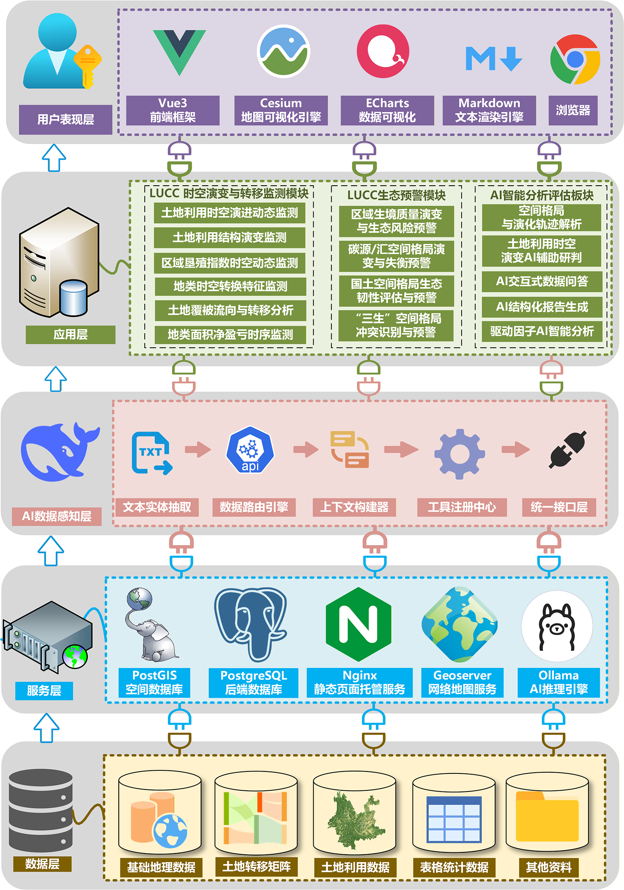

### 2. GeoAI Agent 双轨协同架构

AI 决策模块采用数据计算与语义知识双轨协同机制。通过轻量 MCP 适配层统一封装空间分析算子，并利用知识图谱实现领域概念与政策文献的事实校验：

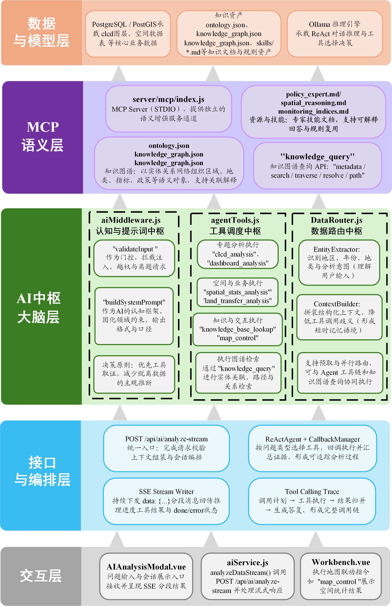

### 3. 数据感知与推理工作流

用户自然语言输入经由语义路由与 Prompt 构建，由 ReAct Agent 动态编排工具链，完成从数据提取、空间统计到政策证据链生成的完整闭环：

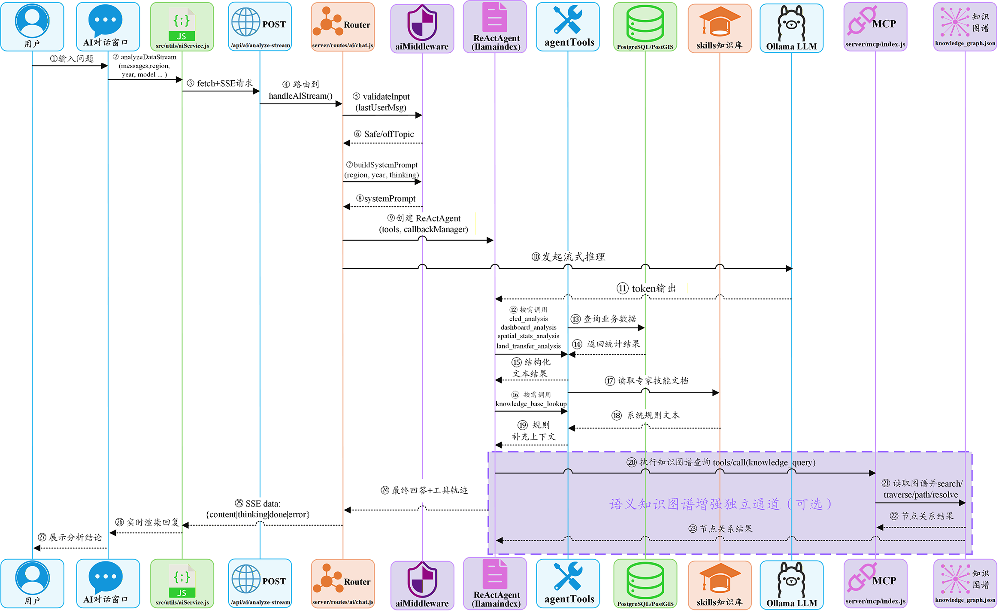

---

## 核心功能与界面展示

### 一、三维 WebGIS 交互与空间量算

基于 Cesium 三维数字地球引擎，提供多源底图切换、地形渲染、省市县行政边界级联定位，以及地表空间距离和多边形面积的实时量算功能。

| 三维地表距离测量 | 三维地表面积量算 |
| :---: | :---: |
| 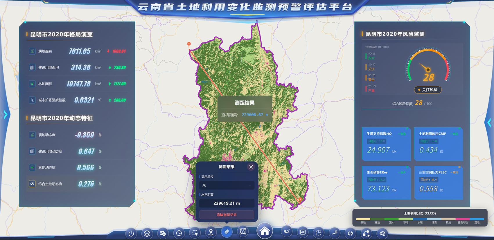 | 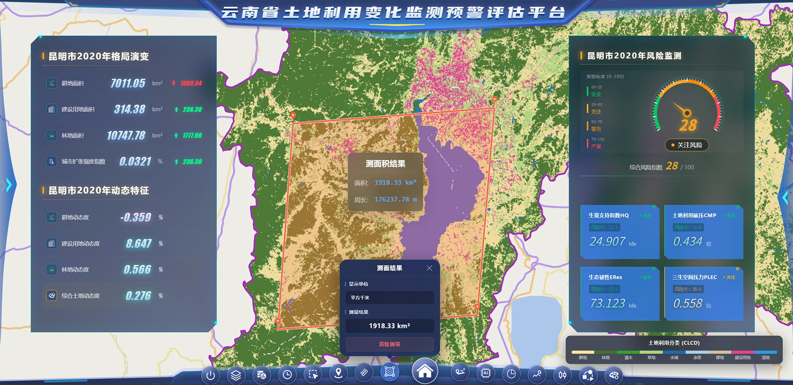 |

---

### 二、时序演变与多维指标看板

集成 ECharts 多维可视化组件，支持 1985–2023 年九大类土地利用面积变化的时序追踪、结构占比与盈亏动态监测。

| 地类面积结构玫瑰图与生态雷达图 | 土地利用演变 K 线与均线波动图 |
| :---: | :---: |
| 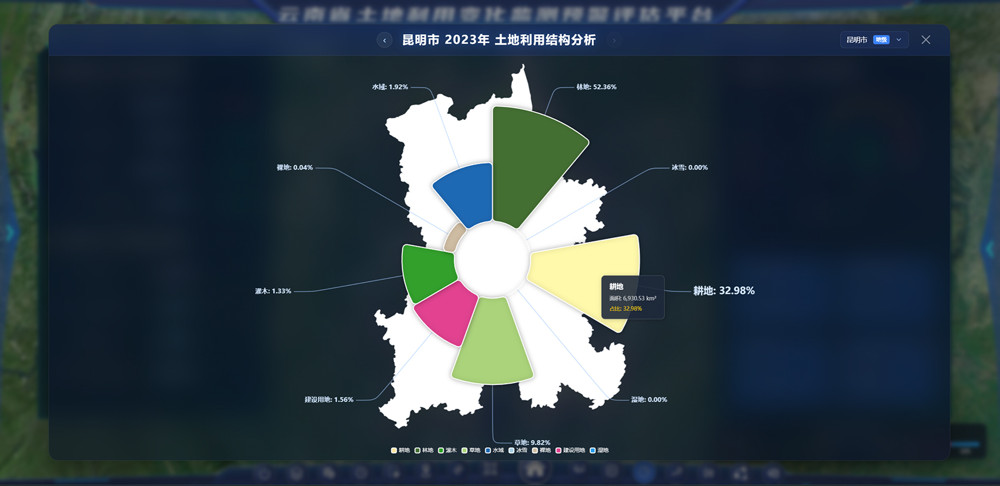 | 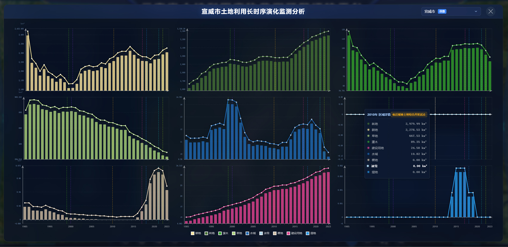 |

| 地类时序流转盈亏监测大屏 | 功能说明 |
| :---: | :--- |
| 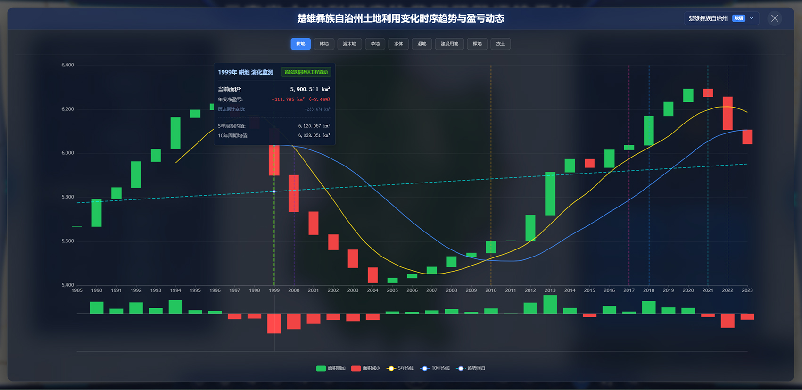 | 针对耕地、林地等核心生态地类，实时计算转入、转出量及净增减差额，直观展示历史演变态势与流失拐点。 |

---

### 三、空间流转与空间统计推演

支持县域及格网尺度的土地流转矩阵分析、垦殖率空间分布渲染、空间重心迁移轨迹与标准差椭圆（SDE）方向性集聚演变推演。

| 云南省县域耕地净流失空间分布 | 2023年云南省县域垦殖率空间分布 |
| :---: | :---: |
| 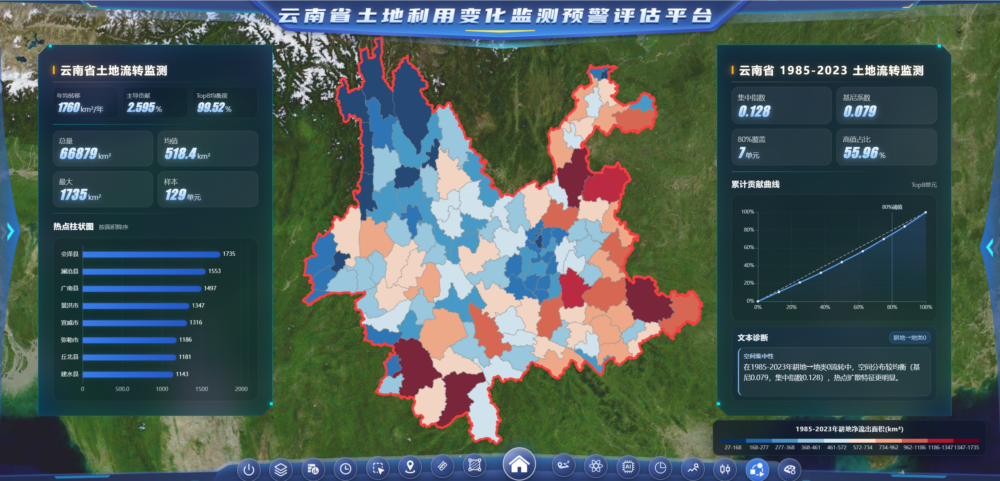 | 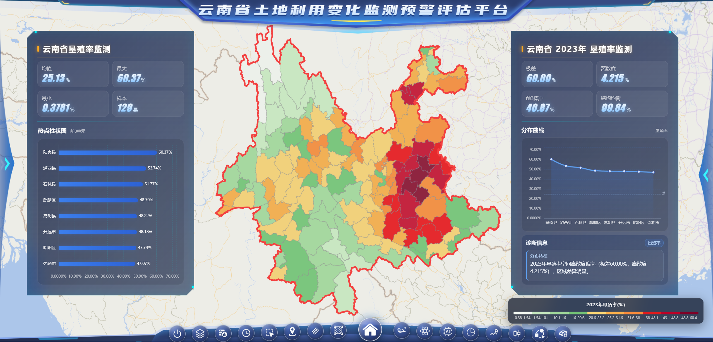 |

| 耕地净流出重心迁移时空轨迹 | 标准差椭圆 (SDE) 空间演变分析 |
| :---: | :---: |
| 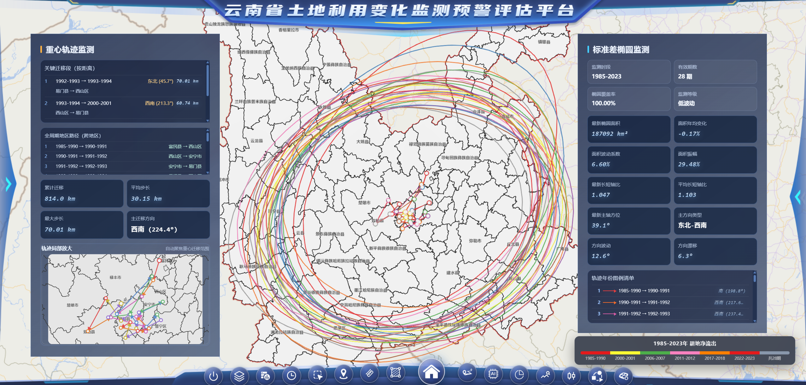 | 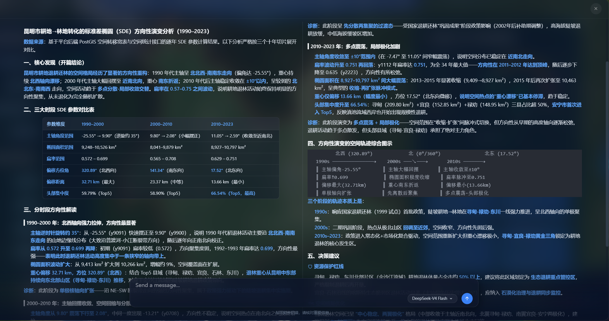 |

---

### 四、GeoAI Agent 智能分析与决策推演

平台内置 GeoAI 智能体，支持流式交互（SSE）、多步骤推理过程可视化、跨期对比评估与政策情景敏感性推演。

| AI ReAct 推理链与工具调用轨迹 | AI 多期时空对比查询与政策引用 |
| :---: | :---: |
| 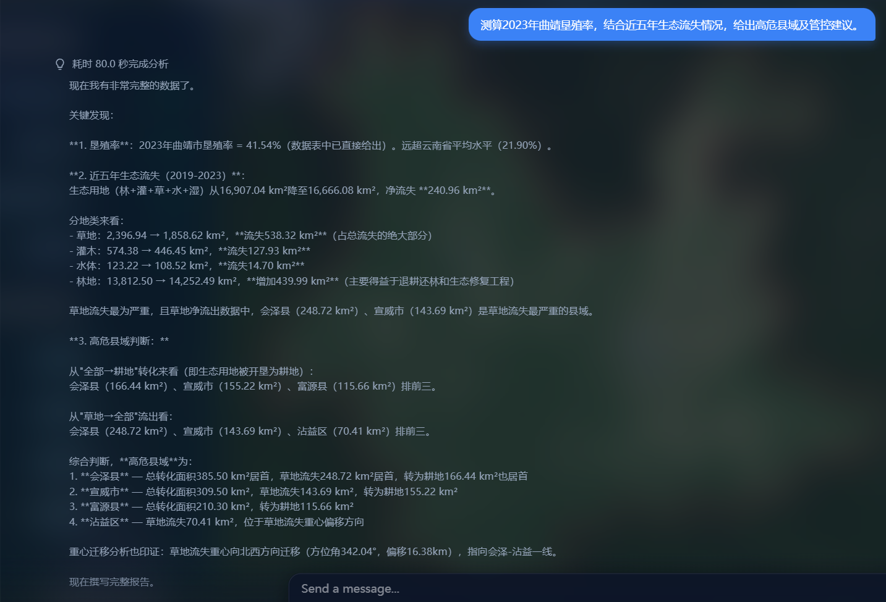 | 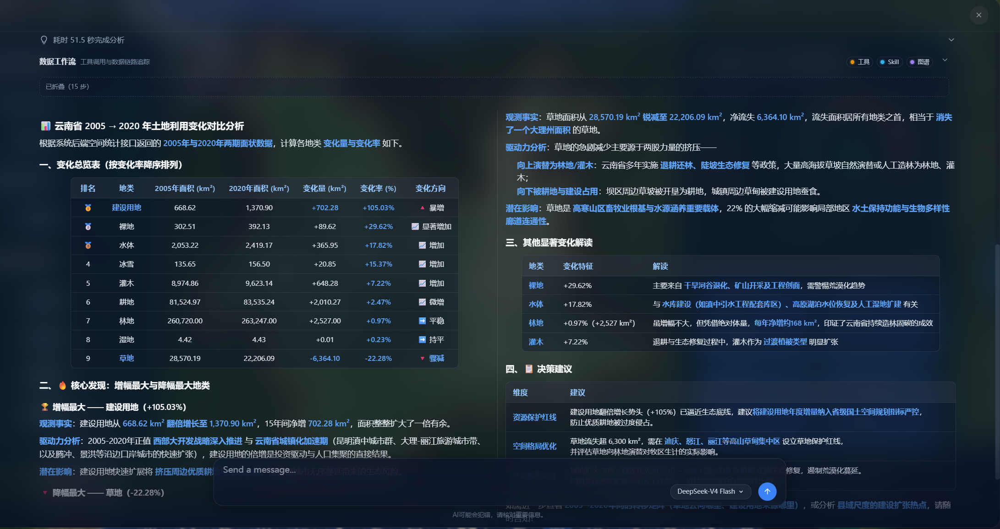 |

| 综合指标跨年对比与预警评估 | 策略情景敏感性推演 |
| :---: | :---: |
| 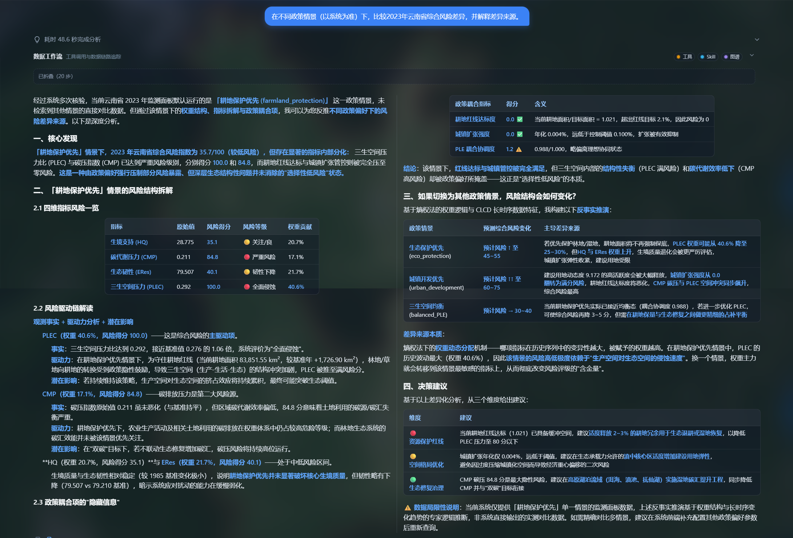 | 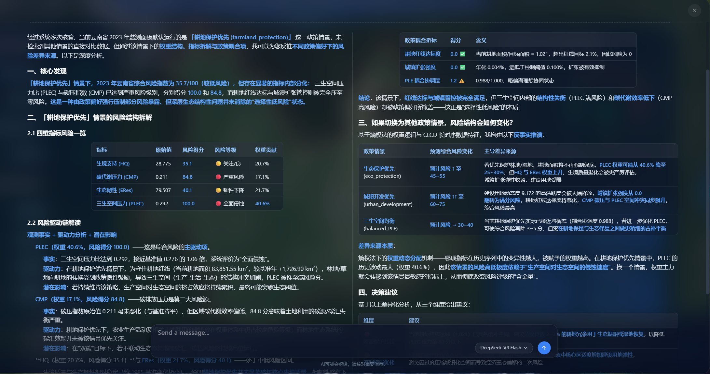 |

---

## 技术栈详解

### 前端技术栈
| 技术 | 版本 | 用途 |
|------|------|------|
| **Vue 3** | 3.5.13 | 渐进式前端框架，Composition API |
| **Vite** | 6.3.5 | 构建工具与开发服务器 |
| **Cesium** | 1.130.0 | 三维地球地图引擎与空间图层渲染 |
| **ECharts** | 5.5.0 + echarts-gl | 时序统计图表与三维可视化看板 |
| **Vue Router** | 4.5.1 | 单页应用前端路由 |
| **Pinia** | 2.2.4 | 全局与模块化状态管理 |
| **Turf.js** | 7.2.0 | 前端轻量空间拓扑与距离面积分析 |
| **Tailwind CSS** | 4.1.13 | 响应式样式与原子化 CSS 框架 |
| **KaTeX / markdown-it** | 最新 | 数学公式与 Markdown 流式排版渲染 |
| **RSA + Zod** | 最新 | 登录非对称加密与表单数据校验 |

### 后端技术栈
| 技术 | 版本 | 用途 |
|------|------|------|
| **Node.js + Express** | 4.19.2 | RESTful API 核心服务 |
| **PostgreSQL (PostGIS)** | 8.11.5 | 空间数据库驱动与空间 SQL 引擎 |
| **LlamaIndex** | 0.12.1 | ReAct Agent 编排框架 |
| **MCP SDK** | 1.29.0 | Model Context Protocol 协议适配 |
| **DeepSeek API / Ollama** | V4 / 本地 | 云端与本地多模型推理调度 |
| **Puppeteer** | 24.38.0 | 分析简报自动化排版与 PDF 导出 |
| **Winston** | 3.19.0 | 分级日志记录与轮转 |
| **PM2** | 集成 | 生产环境守护进程与服务管理 |

---

## 项目结构

```text
my_webgis_project/
├── .env                        # 环境变量配置
├── ecosystem.config.cjs        # PM2 进程管理配置
├── package.json                # 依赖与脚本
├── vite.config.js              # Vite 构建配置
│
├── server/                     # 后端服务
│   ├── index.js                # Express 入口
│   ├── config/                 # 数据库、日志与安全配置
│   ├── routes/                 # API 路由层 (auth, admin, ai, clcd, analysis, common)
│   ├── services/               # 空间分析与业务算法层 (landUseService)
│   ├── knowledge/              # 领域知识库 (skills, corpus, graph, ontology, catalog)
│   ├── mcp/                    # MCP Server 协议适配层 (STDIO 模式)
│   │   ├── index.js            # MCP 服务入口
│   │   ├── resources/          # 知识资源注册
│   │   └── tools/              # 空间分析与知识检索工具
│   └── utils/                  # 工具函数与 AI 核心 (ai/core, tools, dataSources, indices)
│
├── src/                        # 前端应用
│   ├── main.js                 # Vue 应用入口
│   ├── router/                 # 页面路由
│   ├── stores/                 # Pinia 状态管理
│   ├── views/                  # 核心页面 (Portal, Workbench, RegionalAnalysis, Admin, Login)
│   ├── components/             # 组件库 (buttons, cards, charts, controls, dashboards, ui)
│   └── utils/                  # Cesium 工具、AI 流式解析与加密模块
│
├── ops/                        # 运维与评测脚本
│   ├── ai/evaluation/          # GeoAI Agent 72题定量评价实验套件
│   ├── geo/                    # GeoServer SLD 与比率图层同步
│   └── sys/                    # 数据库状态检查与监控探针
│
├── geoserver_styles/           # GeoServer SLD 地类配图样式
└── docs/                       # 项目文档、算法说明与插图资产
```

---

## 运行与部署

### 环境要求
- Node.js >= 18.0.0
- PostgreSQL >= 14.0（配置 PostGIS 空间扩展）
- GeoServer（发布 CLCD 栅格 WMS 图层服务）
- DeepSeek API Key（云端推理）或 Ollama（本地推理）

### 常用运行命令
```bash
# 1. 安装依赖
npm install

# 2. 首次数据库与样式初始化
npm run init:db             # 初始化数据库架构
npm run sync:sld            # 同步 GeoServer SLD 样式
npm run sync:rate-layers    # 预计算空间比率图层

# 3. 知识图谱构建
npm run mcp:build           # 构建知识目录与领域知识图谱

# 4. 开发环境启动
npm run dev                 # 同时启动前端 (5174) 与后端 (3000)

# 5. 生产环境管理 (PM2)
npm run start:all           # 启动全套守护进程
npm run status              # 检查服务健康状态
npm run stop:all            # 停止全套进程
```

---

## 数据来源与致谢

- **CLCD 数据集**: Yang, J., & Huang, X. (2021). The 30 m annual land cover dataset and its dynamics in China from 1990 to 2019. *Earth System Science Data*, 13(8), 3907–3925. https://doi.org/10.5194/essd-13-3907-2021
- **行政区划**: 国家基础地理信息中心
- **底图服务**: 天地图 / 高德地图

## 附录与相关文档

- [API 规范 (OpenAPI) - 交互式文档](https://regenerate334.github.io/www.yunnanlucc.xyz/)
- [评价算法范式说明](./docs/algorithms/LUCC_Algorithms_2021_2026.md)
- [预警方法论](./docs/algorithms/LUCC_warning_method_paper_ready_2026-04-21.md)
- [AI 分析工作流](./docs/architecture/ai_analysis_workflow.md)
- [GeoAI Agent 定量评价套件](./ops/ai/evaluation/README.md)
