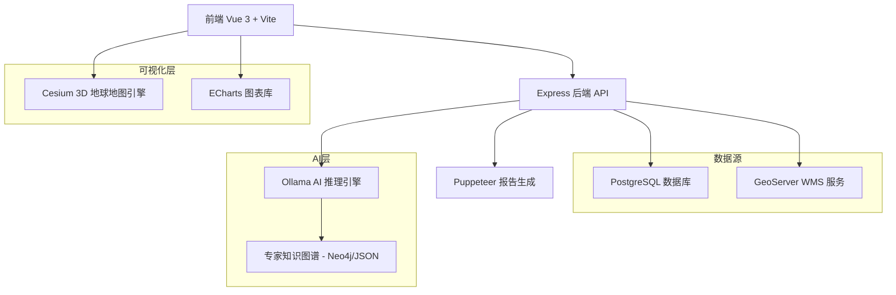
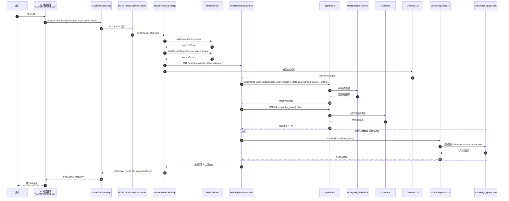

# 云南省土地利用变化监测预警评估平台


论文《基于WebGIS和GeoAI Agent的土地利用变化智能监测评估系统》的配套实现代码。系统基于 Vue 3 + Cesium 构建，接入 CLCD 数据集（30m，1985–2023），实现省-市-县三级土地利用数据的查询、可视化、预警评估与 AI 辅助分析。


## 项目概述

**项目类型**: 全栈 WebGIS 应用  
**核心功能**: 基于中国年度土地覆盖数据集 (CLCD) 的国土空间格局监测、可视化与辅助分析  
**数据范围**: 云南省 1985-2023 年土地利用历史数据  
**AI 能力**: 基于 ReAct Agent 架构，集成本地知识图谱与多模型推理，支持自然语言数据查询与分析报告生成。

---

## 主要功能

- 基于指标体系的国土空间规划监测与预警评估
- 多源地理空间数据集成，支持省-市-县三级行政单元逐级查询
- 内置 AI 分析助手，支持自然语言交互的数据查询与趋势解读
- K 线波动分析与桑基转移图，用于地类面积异常监测和流转分析
- 用户角色管理与操作审计
- 领域知识图谱辅助事实校验，约束 LLM 生成内容的准确性
- 分析结论可导出为 PDF 报告

---

## 技术架构

### 整体架构


### 技术栈详解

#### 前端技术
| 技术 | 版本 | 用途 |
|------|------|------|
| **Vue 3** | 3.5.13 | 渐进式前端框架，Composition API |
| **Vite** | 6.3.5 | 快速构建工具 |
| **Cesium** | 1.130.0 | 3D 地球和地图可视化 |
| **ECharts** | 5.5.0 | 数据可视化图表库 |
| **Vue Router** | 4.5.1 | 单页应用路由 |
| **Pinia** | 2.2.4 | 状态管理 |
| **Turf.js** | 7.2.0 | 空间分析库 |
| **markdown-it** | 14.x | Markdown 渲染 |
| **KaTeX** | 0.16.x | 数学公式渲染 |
| **RSA Crypto** | - | 登录密码非对称加密传输 |

#### 后端技术
| 技术 | 版本 | 用途 |
|------|------|------|
| **Node.js + Express** | 4.19.2 | RESTful API 服务器 |
| **PostgreSQL (pg)** | 8.11.5 | 关系型数据库驱动 |
| **Ollama SDK** | 0.6.3 | 本地 AI 模型推理 |
| **LlamaIndex** | 0.12.1 | 数据连接与 ReAct 智能体框架 |
| **MCP SDK** | 1.29.0 | 模型上下文协议，增强 AI 环境感知 |
| **CORS** | 2.8.5 | 跨域资源共享 |
| **dotenv** | 16.4.5 | 环境变量管理 |
| **PowerShell** | 集成 | 系统资源监控 |
| **bcryptjs** | 3.0.3 | 用户凭证安全存储 |
| **Puppeteer** | 24.38.0 | 报告生成与 PDF 导出 |

#### AI 模型支持
| 模型 | 参数量 | 特点 |
|------|--------|------|
| **deepseek-v4-flash** | - | DeepSeek 官方云端模型 (系统默认) |
| **deepseek-r1:8b** | 8B | 本地部署，兼顾推理质量与速度 |
| **gemma4:e4b** | - | 本地部署，低延迟响应 |
| **gpt-oss:20b** | 20B | 旧版兼容模型 |

---

## 项目结构详解

```
my_webgis_project/
├── 📄 .env                    # [核心配置] 环境变量(API密钥、数据库URL、高德Key等)
├── 📄 .env.example            # [配置模板] 环境变量样例
├── 📄 ecosystem.config.cjs    # [运维] PM2进程管理配置，负责后端服务的守护与自启
├── 📄 index.html              # [入口] SPA应用唯一的HTML页面
├── 📄 package.json            # [依赖] 记录项目所有第三方库版本及运行脚本
├── 📄 vite.config.js          # [构建] Vite配置文件(代理设置、插件配置、打包逻辑)
├── 📄 tailwind.config.js      # [样式] Tailwind CSS 主题与样式范围定义
├── 📄 tsconfig.json           # [标准] TypeScript 编译规范与路径映射定义
│
├── 📂 server/                 # ================== [后端核心逻辑] ==================
│   ├── 📄 index.js            # [主入口] Express/Node.js 服务启动文件
│   ├── 📂 config/             # [基础配置]
│   │   ├── 📄 database.js     # 数据库连接池配置
│   │   ├── 📄 jwt.js          # JWT 登录鉴权加密算法配置
│   │   ├── 📄 logger.js       # Winston 日志分级与保存策略
│   │   └── 📂 keys/           # RSA 公私钥存储(用于安全登录)
│   ├── 📂 routes/             # [路由控制]
│   │   ├── 📄 auth.js         # 登录、注册、修改密码接口
│   │   ├── 📂 ai/             # 智能 Agent 聊天与会话接口
│   │   ├── 📂 analysis/       # 土地利用、空间分析算法接口
│   │   └── 📂 clcd/           # 中国土地利用数据查询接口
│   ├── 📂 controllers/        # [业务控制器] 处理具体路由逻辑
│   ├── 📂 services/           # [核心服务] 纯业务算法逻辑层
│   ├── 📂 middleware/         # [中间件] 统一日志、报错拦截、登录验证
│   ├── 📂 knowledge/          # [知识库] 
│   │   ├── 📄 policy_corpus.json # 土地政策文本库
│   │   └── 📄 knowledge_graph.json # 土地要素关联知识图谱
│   ├── 📂 utils/              # [后端工具]
│   │   ├── 📂 ai/             # Agent 核心逻辑：调度器、大模型客户端
│   │   └── 📂 tools/          # [Agent 技能集] 定义了AI能调用的各种GIS分析工具
│   └── 📂 logs/               # [运行日志] 存储系统报错和访问流水
│
├── 📂 src/                    # ================== [前端核心源码] ==================
│   ├── 📄 main.js             # [入口] 初始化 Vue 应用、加载全局插件
│   ├── 📄 App.vue             # [根组件] 页面顶层框架设计
│   ├── 📂 api/                # [接口层] 使用 Axios 封装的所有后端请求函数
│   ├── 📂 assets/             # [静态资源]
│   │   ├── 📂 icons/          # 土地分类、功能工具的矢量/像素图标
│   │   └── 📂 images/         # 背景图、3D纹理、登录页大图
│   ├── 📂 components/         # [组件库]
│   │   ├── 📂 buttons/        # 测量、重置、分析等功能性交互按钮
│   │   ├── 📂 charts/         # 封装好的 ECharts 报表组件(K线图、玫瑰图等)
│   │   ├── 📂 dashboards/     # 工作台左右侧浮动的数据面板
│   │   └── 📂 ui/             # 弹窗、加载动画、通用选择器
│   ├── 📂 stores/             # [状态管理] Pinia 存储，记录全局地图状态、用户信息
│   ├── 📂 views/              # [页面级组件]
│   │   ├── 📄 Workbench.vue   # 地图主工作台页面(最核心)
│   │   ├── 📄 Login.vue       # 登录鉴权页面
│   │   └── 📄 Portal.vue      # 系统入口门户页面
│   ├── 📂 utils/              # [前端工具]
│   │   ├── 📄 cesiumUtils.js  # Cesium 地图底层能力封装(飞行、图层控制)
│   │   └── 📄 aiService.js    # 处理流式 AI 对话的数据解析
│   └── 📂 types/              # [定义] TypeScript 的接口与类型声明
│
├── 📂 ops/                    # ================== [系统运维目录] ==================
│   ├── 📄 deploy_assets_to_production.bat # [部署] 资源同步脚本
│   └── 📂 data/               # 生产环境备份及同步数据
│
├── 📂 geoserver/              # ================== [地图服务配置] ==================
│   └── 📂 geoserver_styles/   # 存储所有空间图层的 SLD 配图样式文件
│
├── 📂 database/               # [数据库] 存储初始化 SQL 和备份文件
└── 📂 tmp/                    # [临时目录] 存储数据预处理、面积校验的草稿脚本

```

---

## AI 分析功能

### 功能说明

1. **ReAct Agent 架构**
   - 基于 LlamaIndex 实现，根据用户问题自动选择和调用工具函数（Tool Use）
   - 支持向前端地图下发图层控制指令
   - 通过知识图谱进行事实校验，减少模型幻觉

2. **多模型切换**
   - 支持 1.5B 至 20B 不同规模的语言模型
   - 可根据任务需求手动或自动切换模型
   - 支持本地 Ollama 推理与 MCP 协议环境感知

3. **推理过程可视化**
   - 基于 SSE 流式响应，前端实时展示 [SEARCH]、[ANALYSIS]、[REASONING] 等推理阶段标签
   - 支持中断生成

4. **上下文感知**
   - 自动获取当前看板所选行政区和时间范围
   - 支持 1985-2023 年时空趋势分析
   - 数据单位统一为 km²，保留两位小数

5. **会话管理**
   - 多会话历史持久化存储
   - 自动生成会话摘要作为标题
   - 支持引用来源标注

6. **报告导出**
   - 前端即时生成分析报告预览
   - 内置 A4 排版和分页支持，可导出为 PDF
   - 自动根据对话内容生成文件名
 
### AI 分析流程


---

## 后端 API 与管理功能

### 管理后台 (`/api/admin`)
- **用户管理**: 用户 CRUD 与 RSA 协议身份验证。
- **配置管理**: 热修改 `.env` 配置文件，需管理员主密钥授权。
- **安全审计**: 数据库角色风险检测与权限修复。
- **系统监控**: CPU/RAM/IO/TPS 指标实时采集。

#### 系统管理 API (`/api/admin`)
- `GET  /config`: 获取系统 .env 环境变量 (敏感信息自动屏蔽)
- `POST /config`: 热更新系统配置 (需 ADMINISTRATION_KEY 授权)
- `GET  /system/status`: 系统状态 (CPU/Disk/PowerShell 原生负载)
- `GET  /services/health`: 服务健康检查 (含内存占用统计)
- `GET  /db/performance`: 数据库 TPS 与吞吐监控
- `GET  /db/tables`: 核心表行数与占用空间统计
- `GET  /security/db-roles`: PostgreSQL 与 GeoServer 角色审计
- `POST /security/remediate`: 权限修复 (加锁/解锁/回收特权)
- `POST /security/switch-runtime-mode`: 开发/生产运行模式切换

#### AI 分析接口 (`/api/ai`)
- `POST /chat/analyze-stream`: AI 流式分析 (ReAct Agent SSE)

#### CLCD 数据服务
- `GET /api/clcd/province`: 省级时间序列数据
- `GET /api/clcd/prefecture`: 地级市全量数据
- `GET /api/clcd/county`: 县级全量数据
- `GET /api/clcd/trend/:level/:name`: 区域趋势数据

---

## 数据库结构

### 核心数据表

#### 1. `clcd_prefecture` / `clcd_county`
```sql
列: year, region_name, cropland, forest, shrub, grassland, 
    water, snow_ice, barren, impervious, wetland
单位: 平方米 (m²)
```

#### 2. `admin_audit_logs` - 安全审计
```sql
列: id, admin_user, action_type, target_resource, client_ip, timestamp
```

#### 3. `chat_sessions` - 会话存储
```sql
列: id, user_id, title, messages (JSONB), updated_at
```

---

## 前端可视化看板

| 看板名称 | 功能 |
|------|------|
| **K 线分析看板** | 地类面积波动与 EMA 均线趋势 |
| **盈亏分析 Dashboard** | 地类转入/转出对比 |
| **土地转移桑基图** | 地类动态转换流向 |
| **预警指标大屏** | HQ、CMPI、ERes、PLEC 四项指标计算与预警 |

---

## 运行与部署

### 环境要求
- Node.js >= 18.0.0
- PostgreSQL >= 14.0 (支持空间扩展)
- **Ollama**: 用于 AI 推理（可选）

### 日志配置
- `LOG_LEVEL`：控制台日志等级（默认 `info`）
- `LOG_FILE_LEVEL`：写入 `server/logs` 的文件日志等级（默认 `info`）

### 启动命令
```bash
# 1. 首次部署
npm run init:db        # 初始化数据库架构与审计日志
npm run sync:sld       # 同步 GeoServer 的 SLD 样式

# 2. 空间比率图层预计算
npm run sync:rate-layers # 计算年度垦殖率/转换率图层

# 3. 运行
npm run dev            # 同时启动前后端
```

---

## 数据来源

- **CLCD 数据集**: Yang, J., & Huang, X. (2021). The 30 m annual land cover dataset and its dynamics in China from 1990 to 2019. *Earth System Science Data*, 13(8), 3907–3925. https://doi.org/10.5194/essd-13-3907-2021
- **行政区划**: 国家基础地理信息中心
- **底图服务**: 天地图 / 高德地图

## 附录

- [API 规范 (Swagger)](file:///c:/projects/webgis/www.yunnanlucc.xyz/docs/api/openapi.yaml)
- [宏观评价算法范式 (2021-2026)](file:///c:/projects/webgis/www.yunnanlucc.xyz/docs/algorithms/LUCC_Algorithms_2021_2026.md)
- [系统架构拓扑](file:///c:/projects/webgis/www.yunnanlucc.xyz/docs/architecture/architecture_diagram.html)

---

项目状态: 生产可用 v2.5
