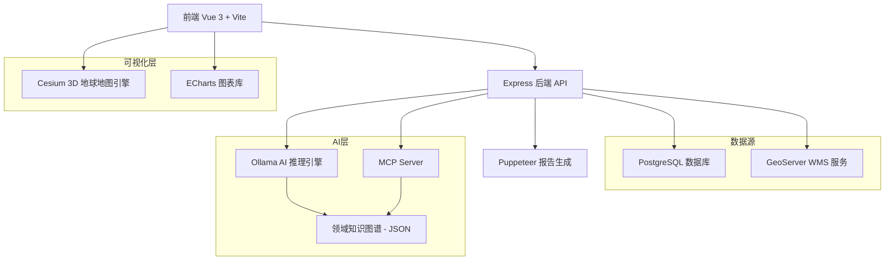

# 云南省土地利用变化监测预警评估平台


论文《基于WebGIS和GeoAI Agent的土地利用变化智能监测评估系统》的配套实现代码。系统基于 Vue 3 + Cesium 构建，接入 CLCD 数据集（30m，1985–2023），实现[...]


## 项目概述

**项目类型**: 全栈 WebGIS 应用  
**线上地址**: [www.yunnanlucc.xyz](https://www.yunnanlucc.xyz)  
**核心功能**: 基于中国年度土地覆盖数据集 (CLCD) 的国土空间格局监测、可视化与辅助分析  
**数据范围**: 云南省 1985-2023 年土地利用历史数据  
**AI 能力**: 基于 ReAct Agent 架构（LlamaIndex），集成领域知识图谱（含本体、语料、技能文档）与多模型推理，支持自然语言数据查询、趋势解读与政策[...]

---

## 主要功能

- 省-市-县三级行政单元 1985–2023 年九类地类面积的逐年查询与趋势分析
- K 线波动图观察地类面积短期异常变动，桑基图展示两个时间断面之间的地类流转
- HQ（栖息地质量）、CMPI（用地复杂度）、ERes（生态弹性）、PLEC（景观效率）四项预警指标自动计算与阈值预警
- 空间统计分析：标准差椭圆 (SDE)、轨迹分析、空间比率图层叠加
- AI 分析助手：自然语言提问 → ReAct Agent 自动调用 7 类工具 → 结合知识图谱生成带引用的分析文本
- 区域综合分析页面：独立的多指标对比与区域画像
- 管理后台：用户管理、配置热修改、数据库角色审计、系统监控
- 分析结论可导出为 PDF 报告

---

## 技术架构

### 整体架构


### 技术栈详解

#### 前端技术
| 技术 | 版本 | 用途 |
|------|------|------|
| **Vue 3** | 3.5.13 | 渐进式前端框架，Composition API |
| **Vite** | 6.3.5 | 构建工具，开发服务器端口 5174 |
| **Cesium** | 1.130.0 | 3D 地球和地图可视化 |
| **ECharts** | 5.5.0 + echarts-gl | 数据可视化（含 3D 图表） |
| **Vue Router** | 4.5.1 | 单页应用路由（5 条路由） |
| **Pinia** | 2.2.4 | 状态管理（6 个 store） |
| **Turf.js** | 7.2.0 | 前端空间分析（面积、缓冲区等） |
| **Tailwind CSS** | 4.1.13 | 原子化 CSS 框架 |
| **markdown-it** | 14.x | Markdown 渲染 |
| **KaTeX** | 0.16.x | 数学公式渲染 |
| **highlight.js** | 11.x | 代码高亮 |
| **RSA + Zod** | - | 登录密码非对称加密传输、数据校验 |

#### 后端技术
| 技术 | 版本 | 用途 |
|------|------|------|
| **Node.js + Express** | 4.19.2 | RESTful API 服务器 |
| **PostgreSQL (pg)** | 8.11.5 | 关系型数据���驱动 |
| **Ollama SDK** | 0.6.3 | 本地 AI 模型推理 |
| **LlamaIndex** | 0.12.1 | ReAct Agent 框架与工具编排 |
| **MCP SDK** | 1.29.0 | 模型上下文协议，知识图谱语义检索 |
| **Helmet** | 8.1.0 | HTTP 安全头 |
| **express-rate-limit** | 8.3.2 | API 限流（500次/15分钟） |
| **express-validator** | 7.3.1 | 请求参数校验 |
| **Winston** | 3.19.0 | 日志分级与按日轮转 |
| **bcryptjs** | 3.0.3 | 用户凭证安全存储 |
| **jsonwebtoken** | 9.0.3 | JWT 认证 |
| **Puppeteer** | 24.38.0 | 报告生成与 PDF 导出 |
| **PM2** | 集成 | 生产环境进程管理（6 个守护进程） |

#### AI 模型支持
| 模型 | 部署方式 | 说明 |
|------|----------|------|
| **deepseek-v4-flash** | 云端 API | 系统默认模型 |
| **deepseek-r1:8b** | 本地 (Ollama) | 离线场景标准选择 |
| **gemma4:e4b** | 本地 (Ollama) | 低延迟响应 |

---

## 项目结构详解

```
my_webgis_project/
├── .env                        # 环境变量 (API密钥、数据库、高德Key等)
├── .env.example                # 环境变量模板
├── ecosystem.config.cjs        # PM2 进程管理 (后端、Nginx、Cloudflare Tunnel、状态探针)
├── index.html                  # SPA 入口页面
├── package.json                # 依赖与脚本
├── vite.config.js              # Vite 配置 (代理、分包、gzip 压缩)
├── tailwind.config.js          # Tailwind CSS 配置
├── tsconfig.json               # TypeScript 编译配置
│
├── server/                     # ==================== 后端 ====================
│   ├── index.js                # Express 入口，中间件加载与路由注册
│   ├── config/                 # 基础配置
│   │   ├── database.js         # 数据库连接池
│   │   ├── db.js               # 数据库辅助
│   │   ├── jwt.js              # JWT 鉴权配置
│   │   ├── logger.js           # Winston 日志配置
│   │   └── keys/               # RSA 公私钥
│   ├── routes/                 # API 路由 (24 个文件)
│   │   ├── index.js            # 路由聚合入口
│   │   ├── auth.js             # 登录、注册、修改密码
│   │   ├── admin.js            # 管理后台 (用户管理、配置、审计、监控)
│   │   ├── ai/                 # AI Agent
│   │   │   ├── chat.js         # 流式分析 (ReAct Agent SSE)
│   │   │   └── session.js      # 会话持久化管理
│   │   ├── analysis/           # 空间分析
│   │   │   ├── dashboard.js    # 综合指标看板
│   │   │   ├── spatial_stats.js # 空间统计 (SDE等)
│   │   │   ├── transfer.js     # 土地转移分析
│   │   │   └── transfer_flow.js # 转移流量计算
│   │   ├── clcd/               # CLCD 数据服务
│   │   │   ├── province.js     # 省级时间序列
│   │   │   ├── prefecture.js   # 地级市数据
│   │   │   ├── county.js       # 县级数据
│   │   │   ├── breaks.js       # 分级断点计算
│   │   │   ├── spatial.js      # 空间查询
│   │   │   ├── rateHelper.js   # 比率计算辅助
│   │   │   └── utils.js        # 数据工具函数
│   │   ├── common/             # 公共服务
│   │   │   ├── regions.js      # 行政区划查询
│   │   │   └── weather.js      # 天气数据 (高德API)
│   │   └── v1/                 # V1 兼容接口
│   │       └── landUse.js
│   ├── controllers/            # 请求处理
│   │   └── landUseController.js
│   ├── services/               # 业务算法层
│   │   └── landUseService.js   # 土地利用核心算法 (40KB)
│   ├── middleware/             # 中间件
│   │   ├── auth.js             # 认证拦截
│   │   ├── logger.js           # 请求日志
│   │   └── responseHandler.js  # 统一响应格式
│   ├── knowledge/              # 领域知识库
│   │   ├── catalog/            # 知识目录索引
│   │   ├── corpus/             # 政策法规语料
│   │   ├── graph/              # 知识图谱 (255KB)
│   │   ├── ontology/           # 领域本体定义
│   │   └── skills/             # Agent 技能文档 (监测指标/政策/空间推理)
│   ├── mcp/                    # MCP Server
│   │   ├── index.js            # MCP 入口
│   │   ├── resources/          # 技能资源注册
│   │   └── tools/              # MCP 工具 (CLCD分析/看板/知识查询)
│   ├── utils/                  # 工具函数
│   │   ├── dataRouter.js       # 数据路由核心 (48KB)
│   │   ├── dataSourceRegistry.js # 数据源注册
│   │   ├── schemaDiscovery.js  # Schema 自动发现
│   │   ├── cryptoHelper.js     # 加密辅助
│   │   ├── period_encoder.js   # 时间段编码
│   │   ├── ai/core/            # Agent 核心
│   │   │   ├── agentTools.js   # 工具注册表
│   │   │   ├── agenticRouter.js # Agent 路由调度
│   │   │   ├── aiClient.js     # Ollama 客户端
│   │   │   ├── aiMiddleware.js # AI 中间件 (Prompt构建/输入校验)
│   │   │   └── deepseekClient.js # DeepSeek 云端客户端
│   │   ├── dataSources/        # 数据源适配
│   │   │   └── transferSource.js
│   │   ├── indices/            # 指标计算
│   │   │   ├── dynamicDegree.js # 动态度
│   │   │   └── transferMatrix.js # 转移矩阵
│   │   └── tools/              # Agent 工具集 (7 类)
│   │       ├── analysis/       # 分析工具
│   │       │   ├── clcdTool.js        # 地类查询
│   │       │   ├── dashboardTool.js   # 综合指标
│   │       │   ├── spatialStatsTool.js # 空间统计
│   │       │   ├── transferTool.js    # 土地转移
│   │       │   └── weatherTool.js     # 气象数据
│   │       └── knowledge/      # 知识工具
│   │           ├── knowledgeTool.js        # 技能库检索
│   │           ├── knowledgeGraphTool.js   # 图谱查询
│   │           └── policyReferenceTool.js  # 政策文献索引
│   └── logs/                   # 运行日志 (按日轮转)
│
├── src/                        # ==================== 前端 ====================
│   ├── main.js                 # Vue 应用入口
│   ├── App.vue                 # 根组件 (router-view)
│   ├── router/                 # 路由配置
│   │   └── index.js            # 5条路由，含导航守卫
│   ├── api/                    # 接口层
│   │   └── index.js            # Axios 请求封装
│   ├── stores/                 # Pinia 状态管理
│   │   ├── admin.js            # 管理后台状态
│   │   ├── auth.ts             # 认证状态
│   │   ├── global.ts           # 全局状态
│   │   ├── landuse.ts          # 土地利用数据状态
│   │   └── map.ts              # 地图状态
│   ├── views/                  # 页面组件
│   │   ├── Portal.vue          # 系统门户 (/)
│   │   ├── Login.vue           # 登录页
│   │   ├── Workbench.vue       # 地图工作台 (核心页面, 159KB)
│   │   ├── RegionalAnalysis.vue # 区域综合分析
│   │   └── Admin.vue           # 管理后台 (需 super_admin 角色, 83KB)
│   ├── components/             # UI 组件库 (44 个组件)
│   │   ├── buttons/            # 功能按钮 (测量、SDE、轨迹分析等, 6个)
│   │   ├── cards/              # 选择器 (底图、区域级联、图层、时间, 5个)
│   │   ├── charts/             # ECharts 图表 (K线、趋势、玫瑰、雷达、预警, 7个)
│   │   ├── controls/           # 分析控制面板 (AI、比率、转移、SDE、空间统计, 8个)
│   │   ├── dashboards/         # 数据看板 (左右浮动面板、分析看板, 14个)
│   │   └── ui/                 # 通用UI (AI对话窗口、图例、底部导航、区域选择, 4个)
│   ├── composables/            # 组合式函数
│   │   └── useMeasurement.ts   # 测量工具逻辑
│   ├── config/                 # 前端配置
│   │   ├── index.js            # 全局配置
│   │   └── indicatorSystems.js # 指标体系定义
│   ├── constants/              # 常量
│   │   ├── landuse.js          # 地类常量
│   │   └── regionMapping.json  # 区域映射表
│   ├── utils/                  # 工具函数
│   │   ├── cesiumUtils.js      # Cesium 封装 (飞行、图层控制)
│   │   ├── aiService.js        # AI 流式对话解析
│   │   ├── clcdDataLoader.js   # CLCD 数据加载
│   │   ├── crypto.js           # 前端加密
│   │   ├── indices.ts          # 指标计算
│   │   └── rateHelper.js       # 比率计算辅助
│   ├── types/                  # TypeScript 类型定义
│   │   ├── chart.ts            # 图表类型
│   │   └── landuse.ts          # 土地利用类型
│   └── assets/                 # 静态资源
│       ├── icons/              # 图标 (business/common/map, 27个)
│       └── images/             # 图片 (背景/UI素材, 6个)
│
├── ops/                        # ==================== 运维 ====================
│   ├── ai/                     # 知识库构建
│   │   ├── build_knowledge_graph.js  # 构建知识目录
│   │   └── build_real_kg.js          # 构建领域知识图谱
│   ├── geo/                    # GeoServer 运维
│   │   ├── gs_sync_all_slds.js       # 同步所有 SLD 样式
│   │   ├── gs_sync_all_rate_layers.js # 预计算比率图层
│   │   ├── gs_upload_one_sld.js      # 上传单个 SLD
│   │   └── gs_restore_layers.js      # 图层恢复
│   ├── sys/                    # 系统运维
│   │   ├── sys_init_db_schema.js     # 数据库初始化
│   │   ├── sys_db_status_check.js    # 数据库状态检查
│   │   ├── status-postgres.js        # PostgreSQL 探针
│   │   ├── status-geoserver.js       # GeoServer 探针
│   │   ├── status-ollama.js          # Ollama 探针
│   │   ├── verify_monitoring.js      # 监控验证
│   │   └── nginx/                    # Nginx 生产配置
│   ├── data/                   # 数据处理脚本
│   └── archive/                # 归档脚本
│
├── geoserver_styles/           # ==================== SLD 配图样式 ====================
│   ├── clcd_standard.sld       # 标准地类配色
│   ├── blank_boundary.sld      # 空白边界
│   ├── land_area/              # 面积动态样式 (9类地类 + 垦殖率/转换率, 12个)
│   ├── land_change/            # 变化分析样式 (差异/变化, 2个)
│   └── land_transfer/          # 转移分析样式 (1个)
│
├── database/                   # 数据库脚本 (初始化查询/Schema检查)
├── docs/                       # 文档
│   ├── algorithms/             # 评价算法文档
│   ├── api/                    # OpenAPI 规范 (openapi.yaml)
│   └── architecture/           # 架构文档与流程图
└── tmp/                        # 临时脚本

```

---

## AI 分析功能

### 功能说明

1. **ReAct Agent 架构**
   - 基于 LlamaIndex 实现，根据用户问题自动选择和调用工具函数
   - 启动时注册 7 类工具：CLCD 查询、综合指标、空间统计、土地转移、气象数据、技能库检索、知识图谱查询、政策文献索引
   - 支持向前端地图下发图层控制指令
   - 通过知识图谱与政策语料进行事实校验，约束模型输出

2. **多模型切换**
   - 支持云端 DeepSeek-V4-Flash 和本地 Ollama 模型
   - 可根据任务需求手动切换，兼顾推理质量与响应速度

3. **推理过程可视化**
   - 基于 SSE 流式响应，前端实时展示 [SEARCH]、[ANALYSIS]、[REASONING] 等推理阶段标签
   - 支持中断生成

4. **上下文感知**
   - 自动获取当前看板所选行政区和时间范围
   - 支持 1985-2023 年时空趋势分析
   - 数据单位统一为 km²，保留两位小数

5. **会话管理**
   - 多会话历史持久化存储（chat_sessions 表，JSONB）
   - 自动生成会话摘要作为标题
   - 支持引用来源标注

6. **报告导出**
   - 前端即时生成分析报告预览
   - 内置 A4 排版和分页支持，通过 Puppeteer 导出 PDF
   - 自动根据对话内容生成文件名

7. **知识图谱 (MCP)**
   - 独立的 MCP Server 提供语义检索通道
   - 支持图谱遍历（search/traverse/path/resolve）
   - 知识库包含领域本体、政策语料、专家技能文档三层结构

### AI 分析流程


---

## 后端 API

### 路由总览

#### 认证 (`/api/auth`)
- `POST /login`: 用户登录（RSA 加密传输）
- `POST /register`: 用户注册
- `POST /change-password`: 修改密码

#### 管理后台 (`/api/admin`)
- `GET  /config`: 获取系统 .env 环境变量（敏感信息自动屏蔽）
- `POST /config`: 热更新系统配置（需 ADMINISTRATION_KEY 授权）
- `GET  /system/status`: 系统状态（CPU/Disk/PowerShell 原生负载）
- `GET  /services/health`: 服务健康检查（含内存占用）
- `GET  /db/performance`: 数据库 TPS 与吞吐监控
- `GET  /db/tables`: 核心表行数与占用空间
- `GET  /security/db-roles`: PostgreSQL 与 GeoServer 角色审计
- `POST /security/remediate`: 权限修复（加锁/解锁/回收特权）
- `POST /security/switch-runtime-mode`: 开发/生产模式切换

#### AI 分析 (`/api/ai`, `/api/chat`, `/api/chat-sessions`)
- `POST /api/chat/analyze-stream`: AI 流式分析（ReAct Agent SSE）
- `GET/POST /api/chat-sessions`: 会话管理（列表/创建/更新/删除）

#### CLCD 数据服务 (`/api/clcd`)
- `GET /province`: 省级时间序列数据
- `GET /prefecture`: 地级市全量数据
- `GET /county`: 县级全量数据
- `GET /trend/:level/:name`: 区域趋势数据
- `GET /breaks`: 分级断点计算
- `GET /spatial`: 空间数据查询

#### 空间分析 (`/api/analysis`)
- `GET /dashboard`: 综合指标看板数据
- `GET /spatial-stats`: 空间统计（SDE 等）
- `GET /transfer`: 土地转移分析
- `GET /transfer-flow`: 转移流量计算

#### 公共服务
- `GET /api/regions`: 行政区划查询
- `GET /api/weather`: 天气数据（高德 API）
- `GET /health`: 健康检查端点

完整接口文档参见 `docs/api/openapi.yaml`。

---

## 数据库结构

### 核心数据表

#### 1. `clcd_prefecture` / `clcd_county`
```sql
列: year, region_name, cropland, forest, shrub, grassland, 
    water, snow_ice, barren, impervious, wetland
单位: 平方米 (m²)
```

#### 2. `admin_audit_logs` - 安全审计
```sql
列: id, admin_user, action_type, target_resource, client_ip, timestamp
```

#### 3. `chat_sessions` - 会话存储
```sql
列: id, user_id, title, messages (JSONB), updated_at
```

---

## 前端可视化看板

| 看板名称 | 功能 |
|------|------|
| **K 线分析看板** | 地类面积波动与 EMA 均线趋势 |
| **盈亏分析 Dashboard** | 地类转入/转出对比 |
| **土地转移桑基图** | 地类动态转换流向 |
| **预警指标大屏** | HQ、CMPI、ERes、PLEC 四项指标计算与预警 |
| **结构分析看板** | 地类结构玫瑰图与生态雷达图 |
| **空间统计看板** | 标准差椭圆、轨迹分析 |
| **比率分析看板** | 垦殖率/转换率空间图层叠加 |

---

## 运行与部署

### 环境要求
- Node.js >= 18.0.0
- PostgreSQL >= 14.0（支持空间扩展）
- GeoServer（发布 CLCD 栅格 WMS 服务）
- Ollama（AI 推理，可选）

### 环境变量

主要配置项（完整模板见 `.env.example`）：

| 分类 | 变量 |
|------|------|
| 前端 | `VITE_TIANDITU_TOKEN`, `VITE_API_BASE_URL` |
| 后端 | `PORT`, `NODE_ENV`, `LOG_LEVEL`, `LOG_FILE_LEVEL` |
| 数据库 | `DB_HOST`, `DB_PORT`, `DB_USER`, `DB_PASSWORD`, `DB_DATABASE` |
| GeoServer | `GEOSERVER_USER`, `GEOSERVER_PASSWORD` |
| AI | `OLLAMA_URL`, `CHAT_MODEL`, `DEEPSEEK_BASE_URL`, `DEEPSEEK_API_KEY` |
| 安全 | `JWT_SECRET`, `DEFAULT_ADMIN_PASSWORD`, `GLOBAL_HOTSWAP_SECRET` |

### 启动命令
```bash
# 安装依赖
npm install

# 首次部署
npm run init:db             # 初始化数据库架构
npm run sync:sld            # 同步 GeoServer SLD 样式
npm run sync:rate-layers    # 预计算空间比率图层

# 构建知识库（AI 功能需要）
npm run mcp:build           # 构建知识目录 + 知识图谱

# 开发环境
npm run dev                 # 同时启动前后端

# 生产环境 (PM2)
npm run start:all           # 启动全部 6 个守护进程
npm run status              # 查看进程状态
npm run stop:all            # 停止全部进程
```

### 日志配置
- `LOG_LEVEL`：控制台日志等级（默认 `info`）
- `LOG_FILE_LEVEL`：写入 `server/logs/` 的文件日志等级（默认 `info`）
- 日志文件按日自动轮转

---

## 数据来源

- **CLCD 数据集**: Yang, J., & Huang, X. (2021). The 30 m annual land cover dataset and its dynamics in China from 1990 to 2019. *Earth System Science Data*, 13(8), 3907–3925. https://doi.or[...]
- **行政区划**: 国家基础地理信息中心
- **底图服务**: 天地图 / 高德地图
- **气象数据**: 高德天气 API

## 附录

- [API 规范 (OpenAPI) - 交互式文档](https://regenerate334.github.io/www.yunnanlucc.xyz/)
- [评价算法范式](./docs/algorithms/LUCC_Algorithms_2021_2026.md)
- [预警方法论](./docs/algorithms/LUCC_warning_method_paper_ready_2026-04-21.md)
- [系统架构拓扑](./docs/architecture/architecture_diagram.html)
- [AI 数据感知层架构](./docs/architecture/ai_data_perception_architecture_diagram.html)
- [AI 分析工作流](./docs/architecture/ai_analysis_workflow.md)

---

线上地址: [www.yunnanlucc.xyz](https://www.yunnanlucc.xyz)
