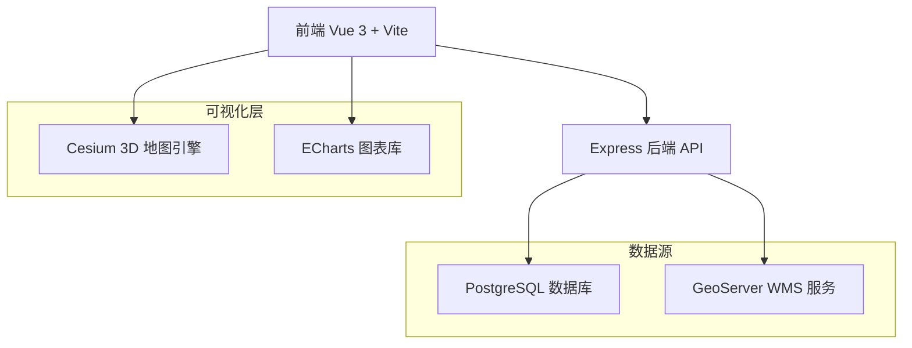
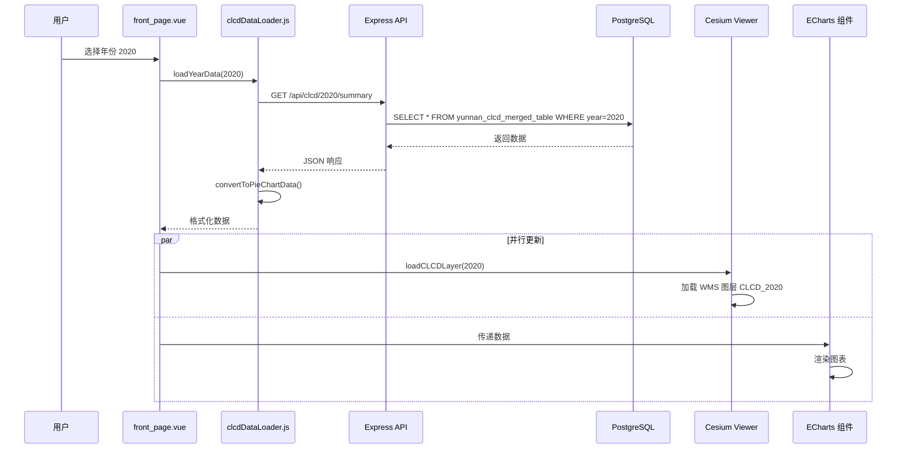

# 云南国土空间规划监测预警平台

一个基于 Vue 3 + Cesium 的现代化 WebGIS 平台，专注于国土空间规划监测预警和空间分析功能。


## 📋 项目概述

**项目类型**: 全栈 WebGIS 应用  
**核心功能**: 基于土地覆盖数据集 (CLCD) 的国土空间格局监测、可视化与分析  
**数据范围**: 云南省 1985-2023 年土地利用历史数据

---

## 🌟 项目特色

- **理论导向**：基于指标体系与方法论的国土空间规划监测
- **数据驱动**：集成多源地理空间数据，支持实时监测预警
- **科技守护**：智能分析引擎，智慧报告图谱
- **交互体验**：现代化 UI 设计，流畅的用户交互

---

## 🏗️ 技术架构

### 整体架构


### 技术栈详解

#### 前端技术
| 技术 | 版本 | 用途 |
|------|------|------|
| **Vue 3** | 3.5.13 | 渐进式前端框架，Composition API |
| **Vite** | 6.3.5 | 快速构建工具 |
| **Cesium** | 1.130.0 | 3D 地球和地图可视化 |
| **ECharts** | 5.5.0 | 数据可视化图表库 |
| **Vue Router** | 4.5.1 | 单页应用路由 |
| **Pinia** | 2.2.4 | 状态管理 |
| **Tailwind CSS** | 4.1.13 | 原子化 CSS 框架 |
| **Turf.js** | 7.2.0 | 空间分析库 |

#### 后端技术
| 技术 | 版本 | 用途 |
|------|------|------|
| **Node.js + Express** | 4.19.2 | RESTful API 服务器 |
| **PostgreSQL (pg)** | 8.11.5 | 关系型数据库驱动 |
| **CORS** | 2.8.5 | 跨域资源共享 |
| **dotenv** | 16.4.5 | 环境变量管理 |

#### 开发工具
- **concurrently**: 并发运行前后端服务
- **PostCSS + Autoprefixer**: CSS 处理
- **TypeScript**: 部分类型定义支持

---

## 📁 项目结构详解

```
my_webgis_project/
├── server/                          # 后端服务
│   ├── index.js                     # Express 主服务器 (271 行)
│   ├── .env                         # 数据库配置 (已忽略)
│   ├── config/                      # 配置文件
│   ├── routes/                      # 路由模块
│   └── scripts/                     # 数据库脚本
│
├── src/                             # 前端源码
│   ├── components/                  # Vue 组件
│   │   ├── front_page.vue          # 主地图页面 (621 行)
│   │   ├── login_page.vue          # 登录首页
│   │   ├── charts/                 # 图表组件集合 (10 个)
│   │   │   ├── LandUsePieChart.vue
│   │   │   ├── LandUseTrendChart.vue
│   │   │   ├── LandTransferSankey.vue
│   │   │   ├── IndicatorRadar.vue
│   │   │   ├── KPIDashboard.vue
│   │   │   ├── StackedAreaChart.vue
│   │   │   └── ...
│   │   ├── controls/               # 控制组件 (10 个)
│   │   │   ├── YearRangeSelector.vue
│   │   │   ├── EChartsPrefecturePie.vue
│   │   │   ├── EChartsCountyPie.vue
│   │   │   ├── TimeController.vue
│   │   │   ├── BaseMapSelector.vue
│   │   │   ├── DistanceMeasureButton.vue
│   │   │   ├── AreaMeasureButton.vue
│   │   │   └── ...
│   │   └── widgets/                # 其他小部件
│   │
│   ├── utils/                      # 工具函数
│   │   ├── clcdDataLoader.js      # CLCD 数据加载器 (280 行)
│   │   ├── mockAPI.ts             # Mock API
│   │   ├── mockDataGenerator.ts   # 模拟数据生成
│   │   └── indicators/            # 指标计算工具
│   │
│   ├── stores/                     # Pinia 状态管理
│   │   ├── map.ts                 # 地图状态
│   │   ├── landuse.ts             # 土地利用数据状态
│   │   └── index.ts
│   │
│   ├── router/                     # 路由配置
│   │   └── index.js               # 2 个路由: / 和 /front
│   │
│   ├── config/                     # 前端配置
│   ├── types/                      # TypeScript 类型定义
│   └── assets/                     # 静态资源
│
├── public/                         # 公共资源
│   ├── data/                       # GeoJSON 数据
│   │   ├── yunnan_boundary.geo.json         # 云南省边界
│   │   └── yunnan_cities_boundary.geo.json  # 云南地级市边界
│   └── images/                     # 图片资源
│
├── tests/                          # 测试文件
├── package.json                    # 项目依赖
├── vite.config.js                 # Vite 配置
└── tailwind.config.js             # Tailwind 配置
```

---

## 🔌 后端 API 架构

### 服务器配置
- **端口**: 3000 (可配置)
- **数据库**: PostgreSQL (默认 yunnan_CLCD)
- **连接池**: 最大 10 个连接

### API 端点总览

#### 1. 健康检查
```http
GET /health
返回: { ok: true, db: 1 }
```

#### 2. 省级数据 API
```http
GET /api/clcd/:year/summary
参数: year (1985-2023)
返回: [{ class_name: "Cropland", area_km2: 123.45 }, ...]
描述: 获取指定年份的省级土地利用面积统计
```

```http
GET /api/clcd/series
查询参数: 
  - level: province|prefecture|county (默认 province)
  - code: 区域代码 (默认 yunnan)
  - start: 起始年份 (默认 1990)
  - end: 结束年份 (默认 2023)
返回: [{ year: 1990, landuse_type: 1, class_name: "Cropland", area_km2: 123 }, ...]
描述: 获取时间序列数据，支持多层级
```

```http
GET /api/clcd/province
返回: [{ year: 1985, cropland: 123, forest: 456, ... }, ...]
描述: 获取省级宽表格式数据
```

#### 3. 地级市数据 API
```http
GET /api/clcd/:year/prefecture-summary
参数: year
返回: [{ prefecture: "昆明市", class_name: "Cropland", area_km2: 123 }, ...]
描述: 获取指定年份各地级市统计
```

```http
GET /api/clcd/prefecture
返回: [{ year: 1985, region_name: "昆明市", cropland: 123, ... }, ...]
描述: 获取地级市宽表数据
```

#### 4. 县级数据 API
```http
GET /api/clcd/county
返回: [{ year: 1985, region_name: "盘龙区", cropland: 123, ... }, ...]
描述: 获取县级宽表数据
```

#### 5. 土地转移矩阵 API
```http
GET /api/clcd/transfer-matrix/periods
返回: ["1985_1990", "1990_1995", ...]
描述: 获取可用的时间段列表
```

```http
GET /api/clcd/transfer-matrix/:period
参数: period (例如 "1985_1990")
返回: {
  absoluteMatrix: { Cropland: { Forest: 123, ... }, ... },
  percentageMatrix: { Cropland: { Forest: 12.5, ... }, ... },
  landTypes: ["Cropland", "Forest", ...],
  period: "1985_1990"
}
描述: 获取指定时间段的土地利用转移矩阵
```

### CLCD 地类映射
```javascript
{
  1: 'Cropland',     // 耕地
  2: 'Forest',       // 森林
  3: 'Shrub',        // 灌木
  4: 'Grassland',    // 草地
  5: 'Water',        // 水体
  6: 'Snow/Ice',     // 冰雪
  7: 'Barren',       // 裸地
  8: 'Impervious',   // 不透水面（建设用地）
  9: 'Wetland'       // 湿地
}
```

---

## 💾 数据库结构

### 核心数据表

#### 1. `yunnan_clcd_merged_table`
长表格式，存储原始统计数据
```sql
列:
- prefecture (地级市)
- landuse_type (地类代码 1-9)
- year (年份)
- area_sqm (面积，平方米)
```

#### 2. `clcd_province`
省级数据宽表
```sql
列:
- id, land_use_type, year, area
```

#### 3. `clcd_prefecture`
地级市数据宽表
```sql
列:
- year, region_name, cropland, forest, shrub, grassland, 
  water, snow_ice, barren, impervious, wetland
```

#### 4. `clcd_county`
县级数据宽表
```sql
列:
- year, region_name, cropland, forest, shrub, ... (同 prefecture)
```

#### 5. `clcd_transfer_matrix`
土地利用转移矩阵
```sql
列:
- period (例如 "1985_1990")
- from_class (起始地类)
- to_class (转换地类)
- area_km2 (转换面积)
```

---

## 🎨 前端组件架构

### 主页面: `front_page.vue`

#### 核心功能模块
1. **Cesium 3D 地图容器**
   - 云南省边界可视化
   - WMS 图层叠加 (CLCD 数据)
   - 可切换底图 (影像/街道/暗色)
   - 垂直俯视视角，禁用倾斜

2. **年份选择器** (`YearRangeSelector.vue`)
   - 位置: 左上角
   - 范围: 1985-2023
   - 触发地图和图表数据更新

3. **控制按钮组**
   - 复位视图
   - 距离测量 (`DistanceMeasureButton.vue`)
   - 面积测量 (`AreaMeasureButton.vue`)
   - 底图选择器 (`BaseMapSelector.vue`)

4. **数据可视化控件**
   - 地级市饼图 (`EChartsPrefecturePie.vue`)
   - 县级饼图 (`EChartsCountyPie.vue`)
   - 趋势图 (`LandUseTrendControl.vue`)

5. **右侧面板**
   - CLCD 图例 (9 种地类配色)
   - 当年土地利用饼图 (`LandUsePieChart.vue`)

### 图表组件详解

| 组件 | 功能 | 数据源 |
|------|------|--------|
| `LandUsePieChart.vue` | 当年土地利用结构饼图 | `/api/clcd/:year/summary` |
| `LandUseTrendChart.vue` | 多年趋势折线图 | `/api/clcd/series` |
| `LandTransferSankey.vue` | 土地转移桑基图 | `/api/clcd/transfer-matrix/:period` |
| `IndicatorRadar.vue` | 指标雷达图 | 计算指标 |
| `KPIDashboard.vue` | KPI 仪表板 | 多源汇总 |
| `StackedAreaChart.vue` | 堆叠面积图 | 时间序列 |
| `EChartsPrefecturePie.vue` | 地级市多饼图（弹窗） | `/api/clcd/:year/prefecture-summary` |
| `EChartsCountyPie.vue` | 县级多饼图（弹窗） | `/api/clcd/county` |

### 数据流管理

#### `clcdDataLoader.js` (核心工具)
```javascript
// 主要函数:
- loadProvinceData()        // 加载省级数据
- loadPrefectureData()      // 加载地级市数据
- loadCountyData()          // 加载县级数据
- getProvinceDataByYear(year)
- getPrefectureDataByYear(year, cityName)
- getCountyDataByYear(year, countyName)
- loadTransferMatrixPeriods()
- loadTransferMatrixData(period)
- convertToPieChartData()   // 数据转换为饼图格式
- convertToTrendChartData() // 数据转换为趋势图格式

// 特性:
✓ 内置缓存机制
✓ 统一错误处理
✓ 数据格式转换
✓ LAND_USE_CONFIG 配置
```

#### Pinia Stores
```javascript
// stores/map.ts
- viewer 实例管理
- 地图状态共享

// stores/landuse.ts
- 土地利用数据状态
- 指标计算结果缓存
```

---

## 🗺️ 空间数据与可视化

### GeoJSON 数据
1. **yunnan_boundary.geo.json** (746 KB)
   - 云南省边界矢量数据
   - 用于边界高亮显示
   - 青色描边 (#00E5FF)，6px 粗细

2. **yunnan_cities_boundary.geo.json** (781 KB)
   - 云南 16 个地级市边界
   - 用于地级市级别分析

### WMS 图层配置
```javascript
// GeoServer WMS 服务
URL: http://localhost:8080/geoserver/WebGIS/wms
图层命名规则: CLCD_1985, CLCD_1990, ..., CLCD_2023
```

### CLCD 配色方案
```javascript
{
  Cropland: '#FFD700',      // 金色
  Forest: '#446F33',        // 深绿
  Shrub: '#33A02C',         // 浅绿
  Grassland: '#ABD37B',     // 草绿
  Water: '#1E69B4',         // 深蓝
  'Snow/Ice': '#A6CEE3',    // 浅蓝
  Barren: '#CFBDA3',        // 棕色
  Impervious: '#DC143C',    // 深红
  Wetland: '#B2DF8A'        // 湿地绿
}
```

---

## 🚀 运行与部署

### 环境要求
- Node.js >= 16.0.0
- npm >= 8.0.0
- PostgreSQL >= 12.0
- GeoServer (可选，用于 WMS 服务)
- **Ollama** (用于 AI 分析功能)

### AI 功能配置
本项目集成了 DeepSeek AI 模型用于智能数据分析。

#### 安装 Ollama
1. 访问 https://ollama.com 下载并安装 Ollama
2. 安装完成后，系统会自动安装 Ollama 服务

#### 使用方法
**在启动项目前，请先手动启动 Ollama：**
- **方法1**：点击桌面或开始菜单的 Ollama 图标
- **方法2**：在命令行运行 `ollama serve`

启动 Ollama 后，系统托盘会显示 Ollama 图标，表示服务已就绪。

### 开发环境启动
```bash
# 安装依赖
npm install

# 启动前：确保 Ollama 已经运行！

# 同时启动前后端
npm run dev

# 单独启动前端 (默认端口 5174)
npm run client

# 单独启动后端 (默认端口 3000)
npm run server

# 停止所有node进程（Windows）
npm run stop
```

### 环境变量配置
需在 `server/.env` 配置:
```env
PGHOST=localhost
PGPORT=5432
PGUSER=postgres
PGPASSWORD=your_password
PGDATABASE=yunnan_CLCD
PORT=3000
```

### 构建与预览
```bash
# 生产构建
npm run build

# 预览构建结果
npm run preview
```

---

## 📊 核心功能特性

### 1. 时空数据可视化
- ✅ 1985-2023 年 39 年历史回放
- ✅ 3D/2D 场景无缝切换
- ✅ 多层级数据展示（省/市/县）
- ✅ 动态 WMS 图层加载

### 2. 空间分析工具
- ✅ 距离测量（两点测距）
- ✅ 面积测量（多边形）
- ✅ 基于 Turf.js 的精确计算

### 3. 数据分析与图表
- ✅ 土地利用结构饼图
- ✅ 多年趋势折线图
- ✅ 土地转移矩阵与桑基图
- ✅ 指标雷达图与 KPI 仪表板
- ✅ 地级市/县级对比分析

### 4. 交互体验
- ✅ 响应式设计
- ✅ 弹窗式详细分析
- ✅ 图例交互
- ✅ 滑块年份控制

---

## 🔍 数据流程图



---

## 🎯 项目亮点与特色

### 技术亮点
1. **前后端分离架构**: Vue 3 + Express，清晰的职责划分
2. **高性能优化**: 
   - 数据缓存机制 (`clcdDataLoader`)
   - 按需加载 WMS 图层
   - PostgreSQL 连接池管理
3. **空间数据处理**: Cesium + Turf.js 组合
4. **组件化设计**: 23 个 Vue 组件，高度可复用
5. **类型安全**: 部分 TypeScript 类型定义

### 业务亮点
1. **多维度分析**: 省/市/县三级数据支持
2. **历史回溯**: 39 年完整数据记录
3. **转移矩阵**: 土地利用变化分析
4. **实时计算**: 指标体系与监测预警

---

## 🎯 使用指南

### 地图操作
1. **缩放控制**：鼠标滚轮缩放，双击快速定位
2. **视角切换**：支持 3D/2D 模式切换
3. **图层管理**：通过时间滑块切换不同年份数据

### 数据分析
1. **年份选择**：左上角年份选择器选择目标年份
2. **图表查看**：右侧面板自动更新图表
3. **详细分析**：点击地级市/县级按钮查看详细分布

### 空间测量
1. **距离测量**：点击测距按钮，在地图上点击两点
2. **面积测量**：点击测面按钮，绘制多边形区域
3. **结果查看**：弹窗显示测量结果

---

## ⚠️ 注意事项

### 系统要求
- 需要 PostgreSQL 数据库运行
- 建议使用现代浏览器 (Chrome, Firefox, Edge)
- 首次加载较慢，请耐心等待

### 已知问题
1. **数据库脚本缺失**: `server/scripts/` 目录为空
2. **环境依赖**: 需要 GeoServer 运行在 8080 端口
3. **测试覆盖**: 测试未集成到构建流程

### 优化建议
1. ✨ 添加 API 文档 (Swagger/OpenAPI)
2. ✨ 提供数据库迁移脚本
3. ✨ 完善用户权限系统
4. ✨ 移动端适配优化
5. ✨ 添加性能监控
6. ✨ 完善单元测试
7. ✨ Docker 化部署

---

## 🔮 未来规划

- [ ] 实时数据接入 API
- [ ] 更多空间分析算法
- [ ] 移动端适配优化
- [ ] 用户权限管理系统
- [ ] 数据导出功能
- [ ] 智能预警系统
- [ ] 多区域支持
- [ ] 数据可视化增强

---

## 📝 总结

这是一个**结构清晰、功能完善的专业级 WebGIS 应用**，具有以下特点:

### 优势
- ✅ **技术栈现代化**: Vue 3 Composition API, Vite, Cesium
- ✅ **架构合理**: 前后端分离，模块化组件设计
- ✅ **功能丰富**: 多维度数据可视化与空间分析
- ✅ **数据完整**: 39 年历史数据，三级行政区划
- ✅ **可扩展性强**: 清晰的代码组织和数据流

### 适用场景
- 🌍 国土空间规划监测
- 📊 土地利用变化分析
- 🗺️ 区域生态环境评估
- 📈 决策支持系统

### 技术亮点总结
1. **大规模时空数据管理** (39 年 × 9 地类 × 3 层级)
2. **3D 可视化与 2D 图表联动**
3. **RESTful API 设计规范**
4. **组件化与状态管理最佳实践**

---

**数据驱动决策，科技守护未来** 🌍

**项目状态**: ✅ 生产可用，建议添加文档和测试后正式部署
