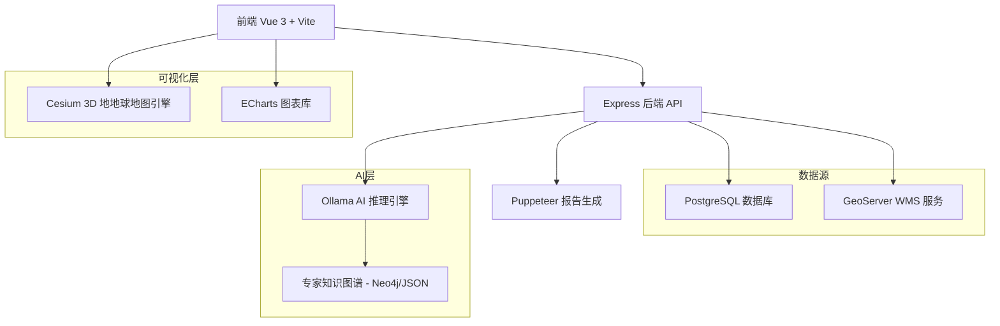
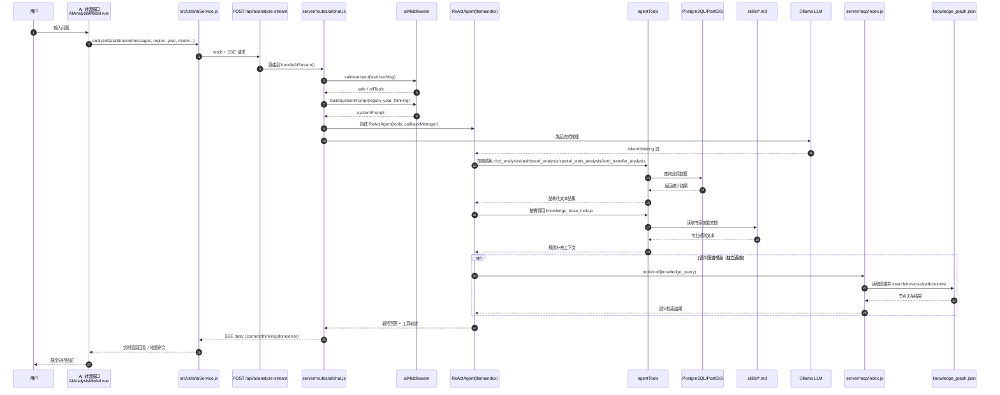

# 云南省土地利用变化监测预警评估平台


一个基于 Vue 3 + Cesium 的现代化 WebGIS 平台，专注于国土空间规划监测预警和空间分析功能，集成 AI 智能分析助手。


## 📋 项目概述

**项目类型**: 全栈 WebGIS 应用  
**核心功能**: 基于土地覆盖数据集 (CLCD) 的国土空间格局监测、可视化与智能分析  
**数据范围**: 云南省 1985-2023 年土地利用历史数据  
**AI 能力**: **全面升级至 AI 2.0 (ReAct Agent)**，集成本地知识图谱 (KG) 与多模型推理，支持自然语言数据查询与证据驱动的深度研判。

---

## 项目特色

- **理论导向**：基于指标体系与方法论的国土空间规划监测
- **数据驱动**：集成多源地理空间数据，支持实时监测预警
- **AI 赋能**：内置智能分析助手，支持自然语言交互与数据解读
- **专业级可视化**：引入金融级 K 线分析与 3D 渲染，深度揭示地类波动规律
- **安全性与治理**：内置超级管理员后台，支持角色审计、实时风险发现及一键权限修复。
- **知识增强**：引入专家知识图谱与证据链解析，告别 AI 幻觉，确保分析结果的权威性。
- **交互体验**：现代化 UI 设计，流畅的用户交互

---

## 🏗️ 技术架构

### 整体架构


### 技术栈详解

#### 前端技术
| 技术 | 版本 | 用途 |
|------|------|------|
| **Vue 3** | 3.5.13 | 渐进式前端框架，Composition API |
| **Vite** | 6.3.5 | 快速构建工具 |
| **Cesium** | 1.130.0 | 3D 地球和地图可视化 |
| **ECharts** | 5.5.0 | 数据可视化图表库 |
| **Vue Router** | 4.5.1 | 单页应用路由 |
| **Pinia** | 2.2.4 | 状态管理 |
| **Turf.js** | 7.2.0 | 空间分析库 |
| **markdown-it** | 14.x | Markdown 渲染 |
| **KaTeX** | 0.16.x | 数学公式渲染 |
| **RSA Crypto** | - | 登录密码非对称加密传输 |

#### 后端技术
| 技术 | 版本 | 用途 |
|------|------|------|
| **Node.js + Express** | 4.19.2 | RESTful API 服务器 |
| **PostgreSQL (pg)** | 8.11.5 | 关系型数据库驱动 |
| **Ollama SDK** | 0.6.3 | 本地 AI 模型推理 |
| **LlamaIndex** | 0.12.1 | 数据连接与 ReAct 智能体框架 |
| **MCP SDK** | 1.29.0 | 模型上下文协议，增强 AI 环境感知 |
| **CORS** | 2.8.5 | 跨域资源共享 |
| **dotenv** | 16.4.5 | 环境变量管理 |
| **PowerShell** | 集成 | 深度系统资源监控与运维 |
| **bcryptjs** | 3.0.3 | 用户凭证安全存储 |
| **Puppeteer** | 24.38.0 | 高度自动化报告生成与 PDF 导出 |

#### AI 模型支持
| 模型 | 参数量 | 特点 |
|------|--------|------|
| **deepseek-v4-flash** | - | DeepSeek 官方云端模型 (系统默认/推荐) |
| **deepseek-r1:8b** | 8B | 本地标准模式，兼顾思考与速度 |
| **gemma4:e4b** | - | 极速量化模式，即时响应 |
| **gpt-oss:20b** | 20B | 旧版兼容模型，本地高性能分析 |

---

## 📁 项目结构详解

```
├── database/                        # 核心 SQL、审计日志表与初始安装定义
├── docs/                            # 项目文档与规范
│   ├── algorithms/                  # 宏观生态评价与土地利用算法说明
│   ├── api/                         # OpenAPI 3.0 接口规范
│   ├── architecture/                # 系统架构图与逻辑拓扑
│   └── assets/                      # 背景图、Banner 等文档静态资源
├── geoserver_styles/                # GeoServer SLD 样式文件库
├── ops/                             # 自动化运维、数据治理与 AI 知识库脚本
│   ├── ai/                          # 知识图谱构建、工具定义、模型同步
│   ├── data/                        # 数据清洗、入库、比对与同步脚本
│   ├── geo/                         # GeoServer 样式同步、比例层预计算
│   ├── sys/                         # Nginx、PM2、SSL 与初始环境部署
│   └── archive/                     # 历史备份与废弃脚本存档
├── public/                          # 静态资源 (图标、Cesium 图块、JSON 数据)
├── server/                          # 后端 Express 核心服务
│   ├── config/                      # 数据库连接池 (pg)、Winston 日志器配置
│   ├── controllers/                 # 业务逻辑控制器 (可选，用于解耦路由)
│   ├── logs/                        # 后端运行日志堆栈
│   ├── mcp/                         # 模型上下文协议 (MCP) 核心适配器
│   ├── middleware/                  # 认证 (JWT)、RBAC、响应处理中间件
│   ├── routes/                      # 业务路由挂载 (Admin, AI, V1, Auth)
│   ├── services/                    # 核心领域逻辑 (LandUse Service 等)
│   └── utils/                       # 分析工具类 (算法、系统监控、密码混淆)
├── src/                             # 前端 Vue 3 + Cesium 应用模块
│   ├── admin/                       # 管理员独立治理组件与逻辑
│   ├── api/                         # 基于 Axios 的前端接口封装
│   ├── assets/                      # 前端样式 (SCSS)、图标与图片
│   ├── components/                  # 通用 UI (charts, maps) 与业务组件
│   ├── composables/                 # 组合式函数 (ECharts Resize, SSE 等)
│   ├── config/                      # 前端全局配置 (Cesium Token, API Base)
│   ├── constants/                   # 语义化常量与字典表定义
│   ├── data/                        # 本地 Mock 数据或静态 JSON 引用
│   ├── router/                      # 页面路由配置与导航守卫
│   ├── stores/                      # Pinia 全局状态 (User, Map, AI)
│   ├── types/                       # TypeScript 类型声明 (d.ts)
│   ├── utils/                       # 前端工具类 (RSA 加密、几何运算)
│   └── views/                       # 容器级页面组件
├── package.json                     # 项目元数据、依赖与运维指令
└── vite.config.js                   # 前端编译环境与插件链配置
```

---

## AI 智能分析功能

### 功能亮点

1. **AI 2.0 (ReAct Agent)**
   - 基于 LlamaIndex 开发，自动编排工具流 (Tool Use)
   - 支持对 WebGIS 地图的实时指令控制与数据透传
   - 彻底告别幻觉：集成行业专家知识图谱进行事实校验

2. **多模型支持**
   - 可切换多种规模的语言模型 (1.5B ~ 20B)
   - 根据任务复杂度自动/手动选择模型
   - 支持本地 Ollama 推理与 MCP 环境感知

3. **思考过程可视化 (SSE)**
   - SSE 实时流式响应，展示包含 [SEARCH]、[ANALYSIS]、[REASONING] 标签的逻辑全图
   - 支持中断生成，逻辑推理实时可查

4. **上下文感知**
   - 自动识别当前看板行政级别与数据内容
   - 支持 1985-2023 年时空趋势深度解析
   - 数据单位自动对齐 (km²)，强制两位小数规范

5. **全生命周期会话管理**
   - 多会话历史持久化存储
   - 自动摘要生成会话标题
   - 完整的 RAG+ 引用来源标记
 
6. **零延迟报告预览与导出 (v2.0 新特性)**
   - **纯前端直出**: 实现分析完即生成的“零等待”体验。
   - **A4 工业级排版**: 内置 PDF 打印优化，支持自动分页、衬线体、渐变页眉。
   - **智能命名**: 自动解析对话摘要为文件名。
 
### AI 分析流程


---

## 🔌 后端 API 与管理治理

### 治理后台 (`/api/admin`)
- **用户治理**: 完整的用户 CRUD 与 RSA 协议身份验证。
- **配置中心**: 热修改 `.env` 配置文件，管理员主密钥保护。
- **安全审计**: 自动探测数据库角色风险，支持一键权限修复。
- **监控看板**: 实时抓取 CPU/RAM/IO/TPS 指标。

#### 系统管理与治理 API (`/api/admin`)
- `GET  /config`: 获取系统 .env 环境变量 (敏感信息自动屏蔽)
- `POST /config`: 热更新系统配置 (需 ADMINISTRATION_KEY 授权)
- `GET  /system/status`: 实时系统看板 (CPU/Disk/PowerShell 原生负载)
- `GET  /services/health`: 服务健康矩阵 (带内存占用统计)
- `GET  /db/performance`: 数据库实时 TPS 与增量吞吐监控
- `GET  /db/tables`: 核心表行数与占用空间统计
- `GET  /security/db-roles`: PostgreSQL 与 GeoServer 角色安全审计
- `POST /security/remediate`: 权限修复 (加锁/解锁/回收特权)
- `POST /security/switch-runtime-mode`: 开发/生产运行模式一键热切换

#### AI 分析接口 (`/api/ai`)
- `POST /chat/analyze-stream`: AI 流式分析 (ReAct Agent SSE)

#### CLCD 数据服务
- `GET /api/clcd/province`: 省级时间序列数据
- `GET /api/clcd/prefecture`: 地级市全量数据
- `GET /api/clcd/county`: 县级全量数据
- `GET /api/clcd/trend/:level/:name`: 区域趋势数据

---

## 💾 数据库结构

### 核心数据表

#### 1. `clcd_prefecture` / `clcd_county`
```sql
列: year, region_name, cropland, forest, shrub, grassland, 
    water, snow_ice, barren, impervious, wetland
单位: 平方米 (m²)
```

#### 2. `admin_audit_logs` - 安全审计
```sql
列: id, admin_user, action_type, target_resource, client_ip, timestamp
```

#### 3. `chat_sessions` - 会话存储
```sql
列: id, user_id, title, messages (JSONB), updated_at
```

---

## 🎨 前端架构与可视化

### 专业级分析看板
| 看板名称 | 核心功能 |
|------|------|
| **K 线分析看板** | 金融级地类面积波动、EMA 均线趋势监测 |
| **盈亏分析 Dashboard** | 地类转入/转出零和博弈可视化 |
| **土地转移桑基图** | 流量拓扑揭示地类动态转换流向 |
| **预警指标大屏** | HQ、CMPI、ERes、PLEC 四大科学指标实时研判 |

---

## 🚀 运行与部署

### 基础环境
- Node.js >= 18.0.0
- PostgreSQL >= 14.0 (支持空间扩展)
- **Ollama**: 用于 AI 2.0 推理

### 日志等级（生产可控）
- `LOG_LEVEL`：控制台日志等级（默认 `info`）
- `LOG_FILE_LEVEL`：写入 `server/logs` 的文件日志等级（默认 `info`）

### 核心指令
```bash
# 1. 首次部署
npm run init:db        # 初始化数据库架构与审计日志
npm run sync:sld       # 同步 GeoServer 的 SLD 样式

# 2. 空间比例层预计算 (重要)
npm run sync:rate-layers # 计算年度垦殖率/转换率图层

# 3. 运行
npm run dev            # 同时启动前后端
```

---

## 📚 附录

- [API 规范 (Swagger)](file:///c:/projects/webgis/www.yunnanlucc.xyz/docs/api/openapi.yaml)
- [宏观评价算法范式 (2021-2026)](file:///c:/projects/webgis/www.yunnanlucc.xyz/docs/algorithms/LUCC_Algorithms_2021_2026.md)
- [系统架构拓扑](file:///c:/projects/webgis/www.yunnanlucc.xyz/docs/architecture/architecture_diagram.html)

---

**数据驱动决策，AI 守护未来**
**项目状态**: 生产可用 v2.5
