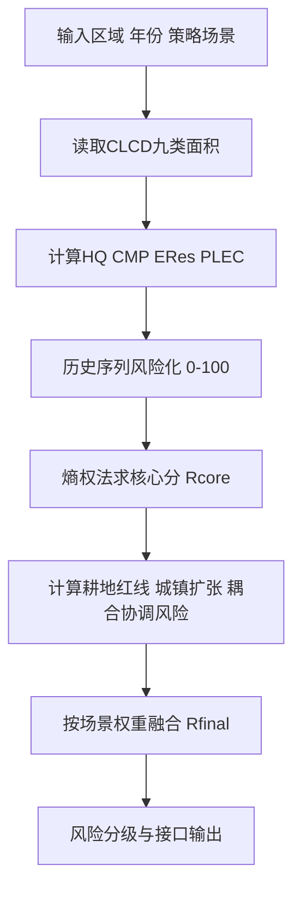

# LUCC 预警指标体系

- 版本：2026-04-22
- 对应实现：`server/services/landUseService.js`
- 适用接口：`/api/clcd/monitoring/:level/:name/:year?policy=...`

---

## 1. 方法定位与证据边界

本文方法由两层组成：

1. 核心指标层（HQ/CMP/ERes/PLEC）  
2. 政策耦合层（红线风险/扩张风险/耦合协调风险）

证据边界需在论文中写清：

1. `HQ` 在本研究中是**生境支持代理指标**，并非完整 InVEST-HQ 模型复现。  
2. `CMP/ERes/PLEC` 属于数据约束下的工程代理指标。  
3. 政策场景权重与阈值是政策导向参数，不是普适自然常数。

---

## 2. 核心指标公式

### 2.1 生境支持代理（HQ proxy）

$$
HQ_t = \frac{\sum_i A_{i,t}\cdot w_i}{\sum_i A_{i,t}} \times 100
$$

其中 $A_{i,t}$ 为第 $t$ 年地类面积，$w_i$ 为地类生境权重。  
本研究的 $w_i$ 依据 HJ 192-2015 的生态质量评价权重映射到 CLCD 地类（见文献 [1]），并明确为代理化实现，不宣称等同 InVEST 原模型（见文献 [2]）。

### 2.2 土地利用碳压代理（CMP proxy）

$$
CMP_t = \frac{C^{source}_t}{C^{sink}_t+\varepsilon}\cdot\left(1+\frac{A_{imp,t}}{A_{tot,t}}\right)
$$

$$
C^{source}_t=A_{crop,t}\cdot c_{crop}
$$

$$
C^{sink}_t=A_{for,t}\cdot c_{for}+A_{shr,t}\cdot c_{shr}+A_{gra,t}\cdot c_{gra}+A_{wat,t}\cdot c_{wat}+A_{wet,t}\cdot c_{wet}+A_{bar,t}\cdot c_{bar}+A_{ice,t}\cdot c_{ice}
$$

本研究采用的系数集合沿用土地利用碳源/碳汇核算文献中的常见取值体系（见文献 [3][4]），用于“区域对比监测”而非“精确碳核算清单”。

### 2.3 生态韧性代理（ERes proxy）

$$
ERes_t=\frac{\sum_i A_{i,t}\cdot r_i}{\sum_i A_{i,t}}\times100
$$

其中 $r_i$ 为地类韧性系数。  
本研究系数属于“地类赋值法”的工程参数化实现，方法范式可参考土地生态修复与韧性研究（见文献 [5]）。

### 2.4 三生空间压力代理（PLEC proxy）

$$
PLEC_t=\frac{2A_{life,t}+A_{prod,t}}{A_{eco,t}+\varepsilon}
$$

$$
A_{life,t}=A_{imp,t},\quad A_{prod,t}=A_{crop,t},\quad A_{eco,t}=A_{for,t}+A_{shr,t}+A_{gra,t}+A_{wat,t}+A_{wet,t}
$$

该式为面向监测的压力代理，不等同于 SCI 标准式；其概念背景来自 PLES 冲突研究（见文献 [6]）。

---

## 3. 风险标准化与熵权核心分

### 3.1 单指标风险化

对历史序列执行 Min-Max 风险映射得到 $S_{j,t}\in[0,100]$：

1. 正向风险指标：CMP、PLEC（值越大风险越高）  
2. 逆向风险指标：HQ、ERes（值越大风险越低，做反向映射）

### 3.2 熵权法

设标准化矩阵元素为 $x_{ij}$：

$$
p_{ij}=\frac{x_{ij}}{\sum_{i=1}^{n}x_{ij}}
$$

$$
e_j=-k\sum_{i=1}^{n}p_{ij}\ln(p_{ij}),\quad k=\frac{1}{\ln n}
$$

$$
d_j=1-e_j,\quad w_j^{(ent)}=\frac{d_j}{\sum_{j=1}^{m}d_j}
$$

熵思想来源见文献 [7]，工程中的熵权评价实现可参考文献 [8]。

### 3.3 熵权核心分

$$
R_t^{core}=\sum_{j=1}^{m}w_j^{(ent)}S_{j,t}
$$

---

## 4. 政策耦合扩展模型

### 4.1 耕地红线风险（库存 + 流量）

目标耕地面积：

$$
A_{crop,target}=A_{crop,base}\cdot\lambda_{crop}
$$

库存风险：

$$
R_{stock}=f\left(\max\left(0,\frac{A_{crop,target}-A_{crop,t}}{A_{crop,target}}\right)\right)
$$

流量风险（同比下降）：

$$
R_{flow}=f\left(\max\left(0,-\frac{A_{crop,t}-A_{crop,t-1}}{A_{crop,t-1}}\right)\right)
$$

合成：

$$
R_{redline}=\omega_sR_{stock}+\omega_fR_{flow}
$$

其中 $\lambda_{crop},\omega_s,\omega_f$ 由政策场景决定，制度背景见文献 [10]。

### 4.2 城镇扩张强度风险（UEI 代理）

$$
UEI_t=\frac{A_{imp,t}-A_{imp,t-1}}{A_{tot,t}\cdot\Delta t}\times100\%
$$

根据场景策略（`control`/`balanced`/`encourage`）将偏离目标强度映射为 $R_{urban}$。

### 4.3 PLE 耦合协调风险（CCD 代理）

设生产、生活、生态子系统状态为 $P,L,E\in[0,1]$：

$$
C=\left(\frac{P\cdot L\cdot E}{\left(\frac{P+L+E}{3}\right)^3}\right)^{1/3}
$$

$$
T=\alpha P+\beta L+\gamma E
$$

$$
D=\sqrt{C\cdot T},\quad R_{coupling}=(1-D)\times100
$$

该表达式属于耦合协调度常用口径，见文献 [5][9]。

### 4.4 最终综合风险

$$
R_t^{final}=w_cR_t^{core}+w_rR_{redline}+w_uR_{urban}+w_kR_{coupling}
$$

其中 $(w_c,w_r,w_u,w_k)$ 为政策场景参数并归一化。

---

## 5. 符号表

| 符号 | 含义 | 单位 |
| :--- | :--- | :--- |
| $t$ | 年份索引 | 年 |
| $A_{i,t}$ | 第 $t$ 年地类 $i$ 面积 | km² |
| $A_{tot,t}$ | 第 $t$ 年总面积 | km² |
| $A_{imp,t}$ | 建设用地面积 | km² |
| $A_{crop,t}$ | 耕地面积 | km² |
| $C^{source}_t, C^{sink}_t$ | 碳源/碳汇代理量 | 相对量 |
| $S_{j,t}$ | 指标 $j$ 的风险分 | 0-100 |
| $w_j^{(ent)}$ | 熵权法权重 | 无量纲 |
| $R_t^{core}$ | 熵权核心分 | 0-100 |
| $R_{redline}$ | 耕地红线风险 | 0-100 |
| $R_{urban}$ | 城镇扩张风险 | 0-100 |
| $R_{coupling}$ | 耦合协调风险 | 0-100 |
| $R_t^{final}$ | 最终综合风险 | 0-100 |

---

## 6. 方法流程图（Mermaid）

---

## 7. 参考文献

[1] 生态环境部. 生态环境状况评价技术规范: HJ 192-2015.  
官方页面: https://www.mee.gov.cn/ywgz/fgbz/bz/bzwb/stzl/201503/t20150324_298011.shtml  
PDF: https://www.mee.gov.cn/ywgz/fgbz/bz/bzwb/stzl/201503/W020150326489785523925.pdf

[2] Natural Capital Project. InVEST Habitat Quality User Guide (v3.16.1).  
https://storage.googleapis.com/releases.naturalcapitalproject.org/invest/3.16.1/userguide/en/habitat_quality.html

[3] Hu, J., Song, M., & Zhang, L. (2025). Spatial and temporal evolution of land use carbon emission and carbon balance zoning: evidence from Xinjiang China. *Scientific Reports*, 15(1):35705.  
DOI: https://doi.org/10.1038/s41598-025-19475-9

[4] Zhang, Q., Ge, J., Liang, Y., Zhang, M., Dong, L., & Zhang, J. (2022). Does intensive land use decoupled from carbon emissions? an empirical study from the three grand economic zones of China. *Frontiers in Environmental Science*, 10:941177.  
DOI: https://doi.org/10.3389/fenvs.2022.941177

[5] Xie, X., Fang, B., & He, S. (2022). Is China’s Urbanization Quality and Ecosystem Health Developing Harmoniously? An Empirical Analysis from Jiangsu, China. *Land*, 11(4):530.  
DOI: https://doi.org/10.3390/land11040530

[6] Lin, G., Jiang, D., Fu, J., Cao, C., & Zhang, D. (2020). Spatial Conflict of Production–Living–Ecological Space and Sustainable-Development Scenario Simulation in Yangtze River Delta Agglomerations. *Sustainability*, 12(6):2175.  
DOI: https://doi.org/10.3390/su12062175

[7] Shannon, C. E. (1948). A Mathematical Theory of Communication. *Bell System Technical Journal*, 27(3):379-423.  
DOI: https://doi.org/10.1002/j.1538-7305.1948.tb01338.x

[8] Chen, P. (2021). Effects of the entropy weight on TOPSIS. *Expert Systems with Applications*, 168:114186.  
DOI: https://doi.org/10.1016/j.eswa.2020.114186

[9] Dong, L., Shang, J., Ali, R., Rehman, R. U., & Hussain, S. (2021). The Coupling Coordinated Relationship Between New-type Urbanization, Eco-Environment and its Driving Mechanism: A Case of Guanzhong, China. *Frontiers in Environmental Science*, 9:638891.  
DOI: https://doi.org/10.3389/fenvs.2021.638891

[10] 中共中央、国务院. 关于建立国土空间规划体系并监督实施的若干意见（2019-05-23）.  
https://www.gov.cn/xinwen/2019-05/23/content_5394187.htm
