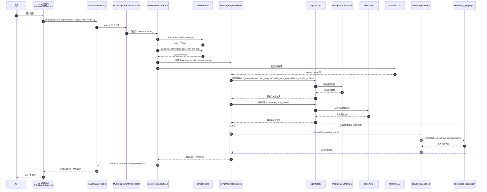

# AI 分析流程（V2，现网链路）

> 说明：该流程图用于替换你给出的旧版时序草图。旧版可以保留，建议新增此 V2 文件作为当前实现基线。  
> 编码：UTF-8

## 旧版与 V2 的关键差异

1. 旧版是 `DataRouter` 直连数据库后再喂给模型；V2 以 `ReActAgent + agentTools` 为主链路，工具在推理过程中按需调用。  
2. 旧版只体现单一 AI 模型流；V2 增加了 `aiMiddleware` 的输入治理与系统提示词构建。  
3. V2 把“专家知识”拆成两类来源：  
   - `knowledge_base_lookup`（`skills/*.md`）  
   - `knowledge_query`（MCP + `knowledge_graph.json`，语义图谱通道）  
4. 前端保持 SSE 实时回流不变，但回流内容包含更明确的工具轨迹和状态提示。  

## 建议

1. 保留旧版流程图作为“历史版本”，新增本文件为“当前版本”。  
2. 如果你要做论文图，建议再配一张“简化版（无代码文件名）”用于正文，“完整版（带文件路径）”放附录。  
